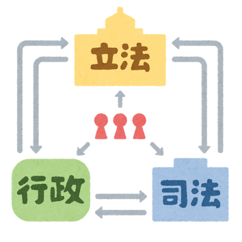

# Markdownの簡単な使い方
## 見出しは「#」を使って表現できる。

# 見出し1
## 見出し2
### 見出し3
#### 見出し4
##### 見出し5
###### 見出し6

適度に使い分けること。
## 改行
改行は「スペース2つ」か「空白行を挟む」ことで表現できる。

この文は
改行されない。

この文は  
改行される。

この文も

改行されない。

## 強調
強調は「アスタリスク」か「アンダースコア」を2つずつ使って囲むことで表現できる。

__強調__

**強調**

## リスト

リストは「ハイフン」か「アスタリスク」か「プラス」を使って表現できる。

- リスト1
- リスト2

* リスト1
* リスト2

+ リスト1
+ リスト2

## 番号付きリスト

番号付きリストは「数字 + ピリオド」を使って表現できる。

1. 番号付きリスト1
2. 番号付きリスト2
3. 番号付きリスト3

全部1でもいい。

1. 番号付きリスト1
1. 番号付きリスト2
1. 番号付きリスト3

- 入れ子状に
  - 表現することもできる
    - こうすることで
      - インデントが深くなる
    - 便利だね

## リンク

リンクは「\[リンク名](URL)」で表現できる。

[markdownのチートシート](https://qiita.com/Qiita/items/c686397e4a0f4f11683d)


ページ内リンクも可能。

[見出し](#見出し)

どんなに見出しが深くても、ハッシュタグは1つでいい。

## コード挿入

コードブロックは「shift + @」で出すバッククォート「`」を三つ並べて囲むことで表現できる。

```
print(Hello World!)
```

言語を記述することで、シンタックスハイライトが適用される。

```python
print("Hello World!")
```

gitの差分ファイルを表現することもできる。

```diff
- class Dog(Animal, Cryable):
+ class Dog(Animal, Cryable, Swimmable):
```

## コメント

もちろん「shift + ,」を押してコメントを適用したところは

<!-- 見えない -->

## 画像

リンクと同じように「\[画像名](URL)」で表現できる。



## 表

表は「パイプ」を使って表現できる。

左揃え
| あいうえお | かきくけこ |
|:-----------|:-----------|
| さ | た |

中央揃え
| あいうえお | かきくけこ |
|:-----------:|:-----------:|
| さ | た |

右揃え
| あいうえお | かきくけこ |
|-----------:|-----------:|
| さ | た |

## 引用

引用は「大なり記号」を使って表現できる。

> あいうえお
> かきくけこ

## 水平線

水平線は「ハイフン」か「アスタリスク」か「アンダースコア」を3つ以上並べることで表現できる。

---

***

___

## 数式

数式を1行に含めるときは「ドル記号」を使って$\LaTeX$形式で表現できる。

$y = ax + b$

$y = \frac{a}{b}$

$\frac{\mathrm{weight}}{\mathrm{height}^2}$

数式が大きかったり改行を含んだり、数式が複数並ぶ場合は、ドル記号を2つ使って数式ブロックを表現できる。

$$
y = ax + b \\
b = 1
$$

$$
\mathrm{BMI} = \frac{\mathrm{weight}}{\mathrm{height}^2}
$$


## その他

「\*」や「\#」などの特殊文字を表現したいときは、前に「バックスラッシュ」をつけることで表現できる。

\* かきくけこ

\# かきくけこ

\> かきくけこ

...

# ここからは実際に教材に使われた内容を含む。ご参考に。

## あいうえお

`Cryable`クラスや`Swimmable`クラスは、あくまで「何かが泣くことができる」「何かが泳ぐことができる」という性質を表現するために用意したものであって、**それ自体が何かを実行するためのクラス**ではない。こうした用法のクラスを**インターフェースクラス**という。

> **名目的部分型**: あるクラスが特定のメソッドを持っているかどうかを判断するために、そのクラスが特定のインターフェースを継承しているかどうかを見る方法

継承は、メソッドや変数を賢く再利用するための方法だ。名前を借りるためだけに空っぽのメソッドを持つクラスを継承することはあまり適切ではない。

## かきくけこ
こうしたときに、**プロトコル**を用いて**構造的部分型**を表現することで、よりスマートなコードを書くことができる。

> **構造的部分型**: あるクラスが特定のメソッドを持っている構造である事を保証するもの

```python
from typing import Protocol
class Animal:
  # "生命体"を表現する壮大なクラス
  # 省略
...
# Animalクラスにコンポジションを使用
class AnimalAction:
    def __init__(self, animal):
        self.animal = animal

    def perform_action(self):
        if isinstance(self.animal, Cryable):
            self.animal.cry()
        if isinstance(self.animal, Jumpable):
            self.animal.jump()
```

## かきくけこの例外
# ●●原則の適用
見えるべきもの
- 始動するメソッド
  - あいうえお
- エンジン回転数（今回はゲッター関数で取得）

見えなくていいもの
- オイル圧力
- エンジン制御ユニット（ECU）の設定