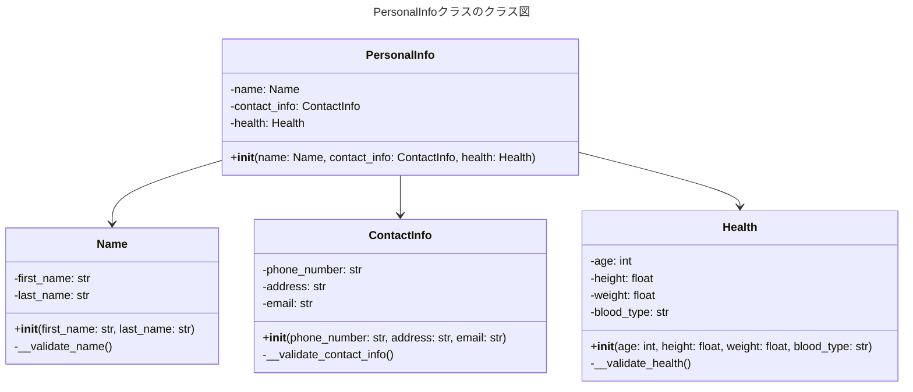
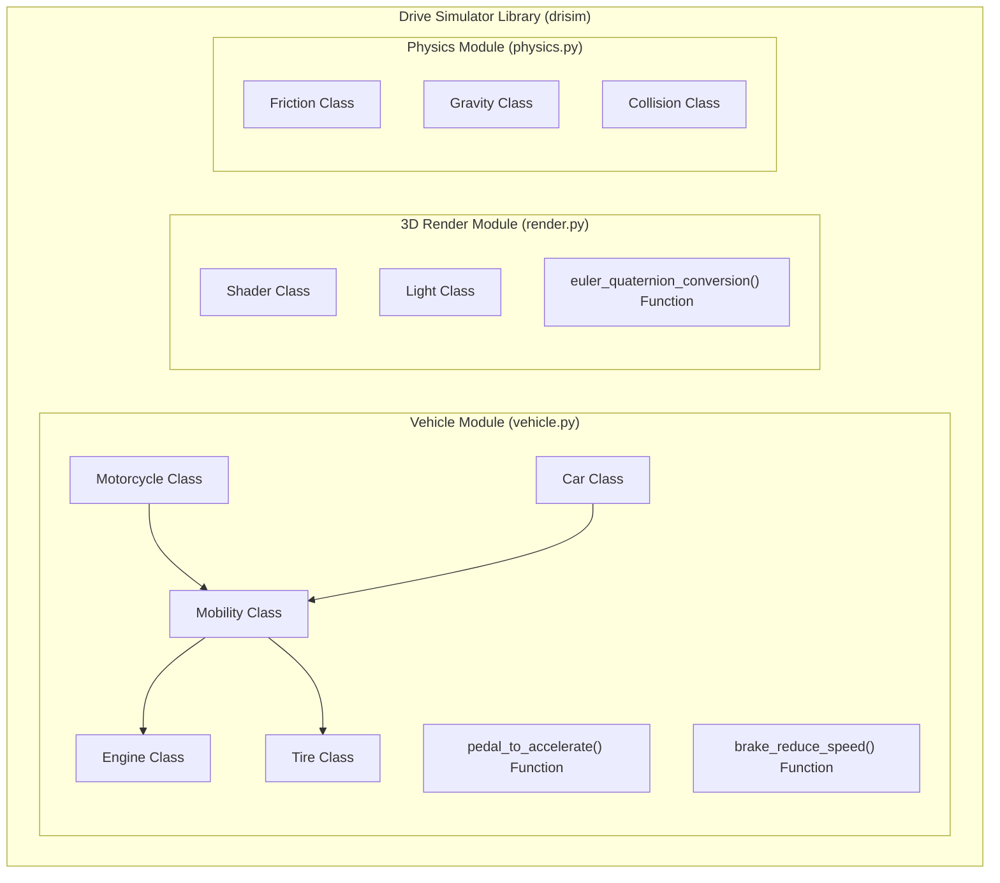
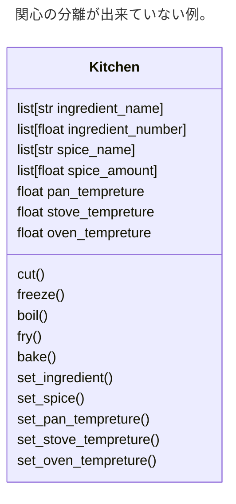
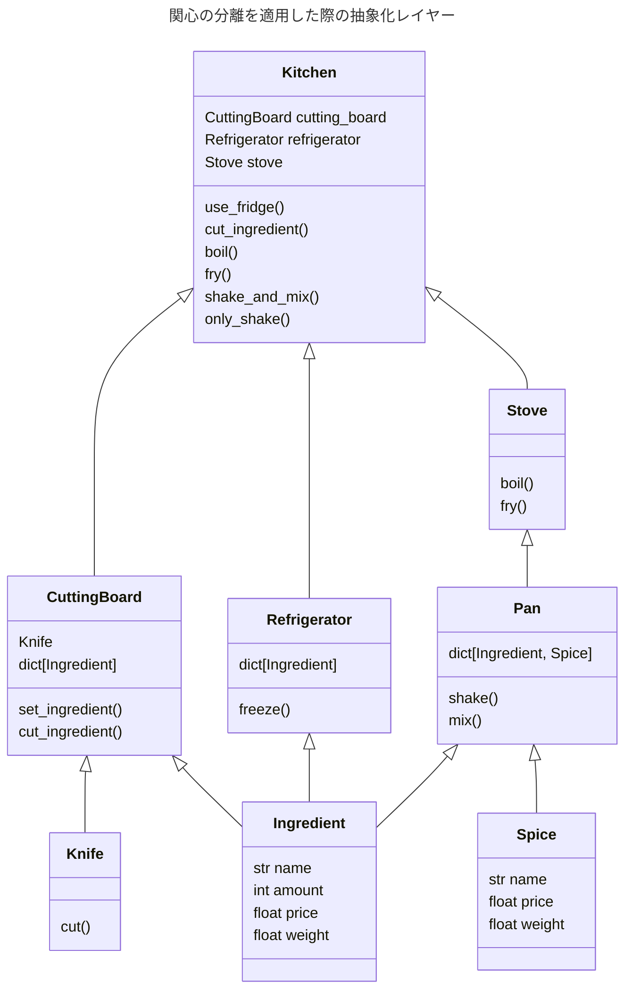
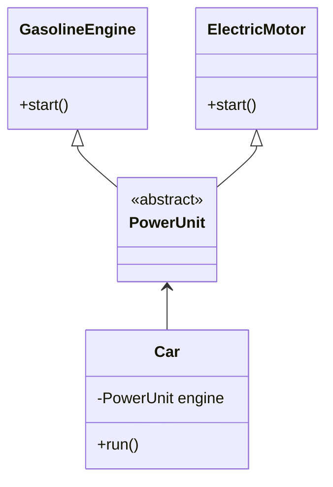
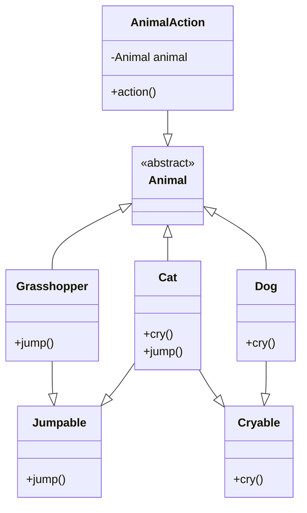

Always code as if the guy who ends up maintaining your code

will be a violent psychopath who knows where you live.

あなたのコードを保守することになる人が，

あなたの住所を知る凶暴な精神異常者になる事態を常に想定してコーディングせよ．
<div style="text-align: right;">Rick Osborne</div>

---
layout: center
---

# ロバストなコードを学ぶ

---

# 命名
## 名前は最初のコメント

身の周りのモノの名前を例にすると
mixer, toaster, pitching machine, slicer
など、<b class="safe">そのモノが何をするか</b>がすぐに予測できる名前が多い。

ところがプログラミングの話になると、途端にみんな<b class="warn">ハッキリしない名前</b>をつけるようになる。

ここからは、そんな名前のつけ方に関するアドバイスを紹介する。

---
layout: two-cols
---

## 名前を省略しない

以下のコードは何を導出するロジック？

```python {*}{lines:true}
d = 0
d = p1 + p2
d = d - ((d1 + d2) /2)
if d < 0:
  d = 0
```

何らかの計算をしているようだけど......

→ ゲームのダメージ計算に関するコード！


::right::

各変数は次の表のような意味

<div class="scrollable-table">

| 変数   | 意味  |
|:------|:--------|
| d | ダメージ量 |
| p1   | プレイヤー本体の攻撃力   |
| p2   | プレイヤーの装備による攻撃力の増加分   |
| d1   | 敵本体の防御力   |
| d2   | 敵の装備による防御力の増加分   |

</div>

---

名前を省略すると

- タイピングが楽
- 名前を考えるのに思考を割かなくて済む

寿命の短いコードならいいのだが、長期的に保守されるコードにおいては

名前が分かりにくいと、読み解くだけでウンザリ...<twemoji-face-vomiting />

特に、数学や物理を授業でのクセで、変数名を`x`や`y`としてしまう人が多い。


---
level: 2
---

「コメントを付ければいいじゃん」という意見もあるかもしれないが

そもそも<b class="warn">コメントは酷い命名の埋め合わせに行うものではない</b>。

```python {*}{lines:false}
# ダメージ量
d = 0
```

以下のように名づけ方がしっかりしていることで、コードの理解が格段に楽になる。

```python {*|1}{lines:true}
damage_amount: int = 0
damage_amount = player_arm_power + player_weapon_power
damage_amount = damage_amount - ((enemy_body_defense + enemy_weapon_defense) / 2)
if damage_amount < 0:
  damage_amount = 0
```

---

変数に名前をつける際、<b class="safe">その値が何であり、何を意味するか</b>を常に意識する。
なぜなら<b class="safe">変数名こそが最小単位のコメント</b>であり、コードベースで<b class="safe">最初に読まれるもの</b>だから。

なお、必ずしも変数名を省略してはいけないというわけではない。

省略変数名が悪なのは、その変数と、変数が保持する値の関連性が結びつきづらいため。

長いコードにおいて、考慮すべき省略変数が多く登場するのは大きなストレスとなる。

そのため、変数の登場範囲が<b class="safe">エディタの画面に収まる程度</b>で、<b class="safe">スコープが十分に小さい</b>（＝変数の寿命が短い）のであれば、**省略変数名を用いても問題ない**。

```python {*}{lines:true}
def fetch_data(url: str) -> dict:
  r = requests.get(url) # レスポンスを示す変数r
  return r.json()
```
```python {*}{lines:true}
for i in range(10):

  # 20~30行程度の処理

  print(i) # インデックスを示す変数i
```

---

## 汎用的すぎる名前

`tmp`, `retval`, `data`, `obj`などといった命名はプログラマーに好まれる。

こういった空虚な名前はあまりにも汎用的すぎて、「<b class="warn">名前のことなんて何も考えていません</b>」と主張しているのと同じ。変数名に`a`とか`b`を使っているのと全く変わらない。

簡単な数値計算を行う関数だからといって怠けてはダメ

その変数が`squared_value`なのか、`root_value`なのか、`denominator`なのかを"他者"に知らせよう。

```python {*}{lines:true}
def calculate_bad(x):
  retval = 0
  for i in range(x.len()):
    retval += x[i] * x[i]
  return retval

def calculate_good(numbers):
  squared_sum = 0
  for i in range(numbers.len()):
    squared_sum += numbers[i] * numbers[i]
  return squared_sum
```

---

変数名が具体的であることで、万が一ロジックが間違っていたとしても<b class="safe">変数名からバグを見つけ出しやす
くなる</b>

たとえば`calculate_bad`関数のfor文内の二乗和を計算する処理を以下のように間違えたとする。

```python {*}{lines:false}
retval += x[i]
```
<b class="warn">変数名が空虚</b>すぎて、いま正しい計算を行っているのか、誤った計算を行っているのかが分からない。

これが、`calculate_good`関数の変数名を利用していたらどうだろうか
```python {*}{lines:false}
squared_sum += numbers[i]
```

`squared_sum`なのに、二乗和を計算していないことが明らかになる。

---

## 明確な名前にする

<div class="small-text">

さすがにさっきのクソコードは極端

「さすがに1文字の変数を羅列することは無いってwww」という人も少なからずいたと思う。

ちょっとステップアップして以下のような関数を見る。

```python {*}{lines:true}
def get_data(url):
  # 何らかの処理
  ...
```

`get`という単語も`data`という単語も抽象的なので、多くの人が好んで命名に使いたがる

しかし抽象的すぎるので、"他者"にとって以下のような混乱をもたらす。

- URL内にある画像をダウンロードする？
- URL内のページ内の文字情報を抽出する？
- URLの各ドメイン情報をリスト形式に分割？

こうした混乱を避けるために`download_img()`や、`extract_text_in_page()`、`split_domain_info()`など「<b class="safe">何をする関数か</b>」明確に命名。

</div>

---

## より「カラフル」な表現の単語を使うことで、解釈の幅を狭めよう。

よく使われがちな<b class="warn">曖昧な表現</b>と、その代替となる<b class="safe">より具体的な表現</b>

<div class="scrollable-table">

| 単語   | 代替案  |
|:------|:--------|
| size | area, number, length, height, width |
| send   | deliver, dispatch, announce, distribute, route, transport |
| find   | search, extract, locate, recover   |
| start   | launch, create, begin, open, execute, run, initialize   |
|update|refresh, renew, revise, modernize, upgrade |
|delete|remove, erase, clear, dispose, expunge, purge|
|change|modify, alter, adjust, transform, adapt|
|check|verify, validate, inspect, examine, review|
|save|store, archive, preserve, record, retain|
|connect|link, join, unite, bridge, interface|
|move|transfer, shift, transport, relocate, navigate|

</div>
<b class="warn">英弱すぎて命名なんて無理？</b>

そういうときこそ<b class="safe">生成AI</b>にやらせればいいんだぜ！

---

# コメント
### コメントに説明を代替させない
主にみんながコメントをどういう目的で使っているか......
- コードが<b class="safe">何</b>をしているのかを説明する

  変数や関数の命名が分かりやすいものならば、コードが**何**をしているのかは自明となるはず。

  → それでもなおコードに多くの細かいコメントが必要な場合、<b class="warn">コードが理想的な読みやすい形でない可能性がある</b>
- コードが<b class="safe">なぜ</b>そのような内容を行うのかを説明する
- <b class="safe">使用方法</b>などを説明する

いずれも「コードの理解を助ける」という意味では重要な役割を果たすが、これを曲解して<b class="warn">不適切な使い方</b>をするとコードの保守性を下げる原因となってしまう......

---


### SSoT その1

親切のつもりで「**すぐにコードを理解して使えるように**」とコメントを書くことがある。

```python {*|2,6}{lines:true}
def get_location():
  # 最初の値は緯度を表し、2番目の値は経度を表す（どちらも単位は[度]）
  ...
  # 座標計算（省略）
  ...
  return (latitude, longitude)
```

---

ロジックに変更が生じた場合、コメントも変更することを忘れてしまうと<b class="warn">コメント内容とロジックが矛盾</b>してしまう。

```diff
def get_location():
  # 最初の値は緯度を表し、2番目の値は経度を表す（どちらも単位は[度]）
  ...
  # 座標計算（省略）
  ...
-  return (latitude, longitude)
+  return (longitude, latitude)
```

`最初の値は緯度を表し、2番目の値は経度を表す`と`return (longitude, latitude)`の部分に関して、<b class="warn">コメントが誤った情報を提供している状態</b>になっているため、"他者"が見ると混乱を招く。

---

二重説明となっているコメントを削り、<b class="safe">情報源を1つに絞る</b>ことで<b class="safe">SSoT</b>を守ろう。

> **SSoT, Single Source of Truth**: 信頼できる情報源は1つだけに留めるべき。

```python {*}{lines:true}
def get_location():
  ...
  # 座標計算（省略）
  ...
  return (longitude, latitude)
```

このように、**コメントではなく変数やロジックからその挙動を理解できるようなコード**を<b class="safe">自己文書化されたコード</b>と呼ぶ。

---

## **なぜ**そのような内容を行うのかを記す
どんなに優れた命名でも、コードやロジックが<b class="safe">なぜ</b>行われるかは非自明。

そのロジックを<b class="safe">選定した理由</b>や、そのロジックが<b class="safe">どのような状況で有効であるか</b>をコメントとして残すことが重要。

一方で<b class="warn">何でも書いたらいいという考えはNG</b>

### → 常識を働かせることが大事。

---

以下のように**明らかに自明な処理においてはコメントは不要**。

```python {*}{lines:true}
def multiply_numbers(a, b):
  result = a * b
  return result
```

### コメントも保守対象なので、<b class="warn">冗長なだけのコメントは逆に有害</b>。

100行のロジックの全行のコメントを書くだけで、保守対象は2倍に膨れ上がってしまう。

全く同じ命名・出力を担うコードでも<b class="warn">最適化のために特殊なテクニック</b>を用いる場合、<b class="safe">詳細なコメント</b>があった方が良い。
```python {*}{lines:true, maxHeight:'200px'}
def multiply_numbers(a, b):
  # ビット演算を用いた掛け算の実装
  result = 0
  while b > 0:
    # bの最下位ビットが1の場合、aをresultに加算
    if b & 1:
      result += a

    # aを1ビット左シフト(2倍)、bを1ビット右シフト(1/2倍)
    a <<= 1
    b >>= 1
  return result
```

---

定数もまた、なぜその値を採用したのかという「<b class="safe">背景</b>」をコメントとして残すことが重要。

例えば、以下のようなコードを見る事がある

```python {*}{lines:false}
JPG_QUALITY = 0.72
```

この変数がJPG画像の品質を意味することはすぐに伝わるので、一見するとコメントは必要なさそうだ。

しかし、<b class="warn">数字の根拠が何かは分からない</b>。

コードが急に崩壊してしまうかもしれないので<b class="warn">変えていいのかさえ分からない</b>。

それほどまでに<b class="warn">根拠なき定数は恐怖をもたらす</b>。

### **数値決定の根拠を説明するコメント**がつくだけで安心感が大幅にUP

```python {*}{lines:false}
JPG_QUALITY = 0.72 # 印刷機の標準品質に合わせた値
```

---

中には、定数値を適当に決めた場合もある。
```python {*}{lines:true}
NUM_THREADS = 8

MAX_PAGES = 1000
```

それなら<b class="safe">「適当に決めた」ということをを正直に書く</b>だけで良い

```python {*}{lines:true}
NUM_THREADS = 8  # 「>= 2 * num_processors」でOK

MAX_PAGES = 1000 # 適当に決めた。多すぎるなら減らしても良さそう。
```

このようなコメントがあれば、"他者"に対して

- 定数を変更して良いこと

- どう変更してもいいか

ということが伝わる。

（[後述](#ハードコーディングを避ける)するが、そもそも定数類はあまりコードに残さず、設定ファイルに退避させるようにしよう。

---

## コメントしないと伝わらないこと

いくら命名に工夫を凝らしても、以下のことは<b class="warn">"他者"に伝わらない</b>

- これから加えるべき変更
- 決定や方針、そのロジックの採用理由
- 直感的でない書き方の理由

コメントによってコードがやや乱雑になってでも<b class="safe">「保守のしやすさ$>$読みづらさ」を優先</b>する

---

## コメントが解決策とは限らない
```python {*}{lines:true}
def generate_id(data: List[str]):
    # data[0]にはユーザの姓、data[1]にはユーザの名が格納されている
    # "(first name).(last name)"という形式によりユーザの姓と名を組み合わせてユーザIDを生成する。
    return data[0] + "." + data[1]
```
上記のコードはコメントが無いと、読んでも<b class="warn">何を実行しているのかが分からない</b>

### → <b class="safe">むしろロジックを変えてみる</b>

---

以下の`first_name()`や`last_name()`などといった<b class="safe">ヘルパー関数</b>を導入することで、コメント（=保守対象）を削減できる。

また、各ヘルパー関数の実装内容を見れば、元の`data`がどのような構造であるかも自明になる。
```python {*}{lines:true}
def first_name(data: List[str]):
    return data[0]

def last_name(data: List[str]):
    return data[1]

def generate_id(data: List[str]):
    return first_name(data) + "." + last_name(data)
```

---

## コメントはあらすじ
小説を読む際、段落の前に<b class="warn">概要がいちいち書いてあるのはウザい</b>

<b class="safe">本の裏表紙や、各章のはじめにあらすじがある程度</b>なら助かる

プログラミングにおいても同様。コメントは以下のように運用するのが好ましい

- クラスの機能や他のエンジニアが知っておくべき<b class="safe">重要な詳細</b>を、トップレベルの目線で説明するドキュメント
- <b class="safe">関数の入力パラメータや</b>、<b class="safe">関数の機能</b>を説明するドキュメント
- <b class="safe">関数の戻り値が何を示しているか</b>を説明するドキュメント

**特殊なロジックなどへの説明コメントはいわゆる「編集者注」や「訳者注」に該当。**

---

### "あらすじ"となるコメントの例

```python {*}{lines:true}
# 顧客が自分で購入した商品を検索する
for customer_id in all_customers:
  for sale in all_sales[customer_id].sales:
    if sale.recipient == customer_id:
      ...
```

```python {*}{lines:true}
def generate_user_report():
  # このユーザーのロックを獲得する
  ...

  # ユーザーの情報をデータベースから読み込む
  ...

  # ユーザーの情報をレポートに書き込む
  ...

  # このユーザーのロックを解除する
  ...
```


---

### 結局どんなコメントを書いたら良いんだってばよ

ここまで登場したのはコメントの書き方に関する、<b class="warn">堅苦しくて抽象的なアドバイス</b>だった。

いちいち「何を書くべきで、書かないべきか」を意識して書くのは面倒くさいし、コードを書くのが遅くなる。

何もかもが面倒になったら<b class="safe">とにかく思ったことをそのまま抜き出す</b>ことから始めよう。

関数を書いていて「ヤバい。これはリストに重複があったら面倒なことになるぞ」と思ったとする。

それをそのまま書き出せばいい

```python {*}{lines:false}
# ヤバイ。これはリストに重複があったら面倒なことになるぞ
```

<b class="warn">とてもダサいコメント</b>だが<b class="safe">格好つけて何も書かないよりずっとマシ</b>

---
level: 2
---

さすがにちょっと<b class="warn">曖昧すぎる</b>ので、もっと<b class="safe">詳細な言葉</b>に変えよう

- 「ヤバい」は「<b class="safe">注意: この用法に気を付けて</b>」という意味
- 「これ」は「<b class="safe">入力を処理するコード</b>」という意味
- 「面倒なことになる」は「<b class="safe">実装が難しくなる</b>」という意味

これをコメントに落とし込むと、以下のようになる。

```python {*}{lines:false}
# 注意: このコードは入力リストの重複を処理できない（実装が難しいので）
```

---

ここまでの一連の流れ

1. 頭の中にあるコメントをとにかく書き出す
2. コメントを読み、改善が必要そうな曖昧な表現を探す
3. 改善する

これを徹底することで<b class="safe">"他者"がコードを見たときの理解を大きく助ける</b>ことができる。

---
level: 2
---

## コードの欠陥にコメントを書く

「<b class="warn">コードに欠陥を見つけたが、今はこれを修正している時間などない</b>」といった場面が出てくる。

そうしたとき、あなたはその<b class="warn">欠陥を黙っておくべき</b>か？

→ <b class="safe">コメントに欠陥を書いておく</b>ことで<b class="safe">他者がその欠陥を修正する際の手助け</b>となる。

```python {*}{lines:false}
# TODO: もっと多様な入力パターンに対応する
```

```python {*}{lines:false}
# FIXME: 入力が負の数だと、なんだか出力がおかしい
```

---

「TODO」や「FIXME」が登場したが、これらはプログラマーの間で広く使われる表現。

| 記法| 典型的な意味 |
|:------|:--------|
|TODO: | あとで手を付ける。|
|FIXME: | 既知の不具合がある。修正が必要。|
|HACK: | 一時的な"お行儀の悪い"解決策。本当はもっと良い方法があるはず。|
|XXX: | 危険！大きな問題がある。|

<b class="safe">コードの欠陥をあけっぴろげにする事を恥ずかしがってはいけない</b>

---

VSCodeなら「Todo Tree」という拡張機能を入れることをお勧めする。

この拡張機能を入れると、コードごとに書かれた「TODO」や「FIXME」などのコメントが一覧表示される。

<div class="center">
  
</div>

<!--  -->

---

## ドキュメンテーションコメント
VSCodeをはじめとした多くのエディタは、変数やクラス名に対してマウスカーソルをホバーすると、その変数やクラスの説明が表示される。

<div class="min-center">
  
</div>

<!--  -->

<div class="min-center">
  
</div>
<!--  -->

---

僕らが作った関数にホバーすると味気ない......

<div class="min-center">
  
</div>

<!--  -->

僕らの関数も、ホバーした時に説明が出るとテンション上がるよなぁ！？

→ ドキュメンテーションコメントを書こう！

---

以下のようなコードの冒頭に
```python {*}{lines:true}
def square(n):
    return n * n
```

以下のようなドキュメンテーションコメントを追加する。
```python {*}{lines:true}
def square(n: int) -> int:
    """Return the square of a number.

    Parameters
    ----------
    n : int
        The number to square.

    Returns
    -------
    int
        The square of the input number.
    """
    return n * n
```

---

呼び出し元で、この関数へマウスをホバーすると、以下のような説明が表示される。

<div class="small-center">
  
</div>

<!--  -->


一見すると面倒な書き方だが

pythonなら`docstring`と`github copilot`拡張機能の組み合わせによって一瞬で書ける。

---

前述のライブラリなども、クラスやモジュール内にこうしたドキュメンテーションコメントを書いている。

例えば先ほどの`pyplot`の部分にマウスをホバーしてF12キーで定義元へジャンプすると、「生のドキュメント」が表示される。

<div class="middle-center">
  
</div>
<!--  -->

---

ツールを用いればドキュメンテーションコメントから自動でドキュメント生成が可能。（`pyplot`のリンク先のドキュメントの内容が先ほどのドキュメンテーションコメントと同じ！！）

[matplotlib.pyplot](https://matplotlib.org/3.5.3/api/_as_gen/matplotlib.pyplot.html) のみならず [python](https://docs.python.org/3/) や[Linux](https://docs.kernel.org/)に用いられる。

各言語にこうしたドキュメンテーションコメントを書くための規約があるので興味があれば調べてみよう。

---

# 関数
## 賢ぶらない
とにかく、恥を忍んで賢ぶらないこと。

「俺ってば、こんなロジックを知ってるんだぜ」と書いた難解なコードは他者にとってはただの迷惑

繰り返し伝えてきたことを改めていうが、<b class="safe">人にとって分かりやすいロジックを使おう</b>

> Don't be clever. Don't try to write complicated code on purpose to show how smart you are. Write simple, clear, reusable code. Think Simplicity, Clarity, Generality.
>
> 小利口な奴になるな。自分を賢くみせようとして複雑なコードを書かないこと。シンプル、明確、再利用可能なコードを書くこと。シンプルに明確に普遍的に考えること。
> <div style="text-align: right;">Brian Kernighan</div>

---
layout: two-cols
level: 2
---

素直な素数判定アルゴリズムを用いた場合。

```python {*}{lines:true}
# 分かりやすいコード
def is_prime(n: int) -> bool:
    if n < 2:
        return False
    for i in range(2, n):
        if n % i == 0:
            return False
    return True
```

::right::

ミラーラビンの素数判定法（[qiitaより引用](https://qiita.com/ppza53893/items/e0f464340d6f97760cd5#5-aks%E7%B4%A0%E6%95%B0%E5%88%A4%E5%AE%9A%E6%B3%95%E3%82%92%E4%BD%BF%E3%81%86)）。

パフォーマンスを求めるのが目的なら

コメントで"他者"を説得すること

```python {*}{lines:true, maxHeight:'300px'}
# 分かりにくいコード
def select_base(n: int) -> tuple[int, ...]:
    bases: tuple[int, ...]
    if n < 2047:
        bases = (2,)
    elif n < 1373653:
        bases = (2, 3)
    elif n < 9080191:
        bases = (31, 73)
    elif n < 25326001:
        bases = (2, 3, 5)
    elif n < 3215031751:
        bases = (2, 3, 5, 7)
    elif n < 350269456337:
        bases = (
            4230279247111683200, 14694767155120705706, 16641139526367750375
        )
    elif n < 55245642489451:
        bases = (
            2, 141889084524735, 1199124725622454117, 11096072698276303650
        )
    elif n < 7999252175582851:
        bases = (
            2, 4130806001517, 149795463772692060, 186635894390467037,
            3967304179347715805
        )
    elif n < 585226005592931977:
        bases = (
            2, 123635709730000, 9233062284813009, 43835965440333360,
            761179012939631437, 1263739024124850375
        )
    elif n < 2**64:
        bases = (2, 325, 9375, 28178, 450775, 9780504, 1795265022)
    elif n < 3317044064679887385961981:
        bases = (2, 3, 5, 7, 11, 13, 17, 19, 23, 29, 31, 37)
    else:
        raise OverflowError
    return bases

def is_prime(n: int) -> bool:
    assert n > 1
    if n == 2:
        return True
    elif n % 2 == 0:
        return False
    d = n - 1
    s = 0
    while d & 1 == 0:
        s += 1
        d >>= 1

    mr_bases = select_base(n)
    for a in mr_bases:
        if a == n:
            return False
        a %= n
        x = pow(a, d, n)  # a^d mod n
        if x == 1 or x == n-1:
            continue
        for _ in range(s):
            x = pow(x, 2, n)
            if x == n-1:  # a^(d*2^r) mod n
                break
        else:
            return False
    return True
```

---

## Anyに逃げない

`Any`型は全体集合。`int`だろうが`str`だろうが、どんな型でも受け入れる。

`Any`型は便利だ。型が分からないとき、型が複雑で、型を考えるのが面倒なとき、`Any`型を使うことで型の考慮を省略できる。

しかし<b class="warn">`Any`型を使うのは"逃げ"</b>である。

---

型は、<b class="warn">あなたのコーディングを妨げるもの</b>ではなく、<b class="safe">あなたのコーディングをサポートするもの</b>。

### なぜなら型は、命名の次に重要な情報源となるため

以下のコードを考えてみよう。

```python {*}{lines:true}
def some_function(target: Any, place: Any) -> Any:
  # 読むのもうんざりするような長ったらしい処理
```

- `target`と`place`に何を入れたら良いのか分からない
- `some_function`が何を返り値とするのか、見当がつかない

何も分からない状態から、この関数のロジックを読み解く旅に出ることになる。

残念ながら、入出力が全て`Any`型と表された関数は、中身も悲惨な実装となっていることが多い...<twemoji-loudly-crying-face/>

---

型を明記すると？

```python {*}{lines:true}
def some_function(target: List[str], place: int) -> str:
  # 読むのもうんざりするような長ったらしい処理
```

型が分かると、ある程度関数の挙動を推測できるようになる。

- 間違った型の変な値の入力を防げる

- `target` → `List[str]`とあるので、文字列が複数格納されたリスト

- `place`→ `int`とあるので整数

- 返り値 → `str`ということは、`some_function`は文字列を返す

→　「文字列のリスト`target`と整数`place`を受け取り、該当するインデックスの文字列を返す」と推測

<b class="safe">ロジック解読の旅に出る前に、"情報"という初期装備が手に入る。</b>

---
layout: center
---

型を明示しない原因が<b class="warn">怠惰</b>であるなら、今すぐその態度を改めよう

<b class="warn">型が分からない</b>なら、とにかく調べよう。<b class="safe">型の理解が、つよつよプログラマーへの第一歩</b>

「条件によって返す値の型が異なる」という風に複雑な表現を扱う場合は、<b class="safe">複合型</b>を検討しよう。

---

## Union型

`Union`は、複数の型のいずれかを返すことを明示するための型。

```python {*}{lines:true}
from typing import Union

def pet(show_status: int) -> Union[str, int, float]:
  if show_status == 0:
    return "ポチ" # ペットの名前
  elif show_status == 1:
    return 10 # ポチの年齢
  elif show_status == 2:
    return 5.3 # ポチの体重[kg]
```

`Union`で型を明示することで、ロジックを読まずとも以下の情報が得られる。

- `pet`関数に`int`の投げると`str`, `int`, `float`のいずれかを返す
- "**いずれか**"を返すということはつまり、コード内に何らかの分岐がある

---

### Nullを返すことを伝えよう

あなたの関数を使う"他者"は、「必ず有効な値を返す」ことを期待している。

関数が<b class="safe">Nullを返すなら、きちんと型で明示</b>しよう。

そうでないと、"他者"はNullを返すことを知らず<b class="warn">Nullを受け取ったときの処理を書かない</b>かもしれない。

なお、pythonにおいてNullは`None`で表現される。

---

### Nullリターンを知らせないことの危険性

ゲームにおいて所持金額を入れると経験値に変換してくれる`calc_ex_point`関数（適当）

```python {*}{lines:true}
def calc_ex_point(money: int) -> float:
  if money < 0:
    return None
  return math.log(money) * money
```
あなたは`math.log`関数が負の値を受け取るとエラーを返すことを知っているので条件分岐を入れた

しかし"他者"は
所持金額を経験値に変換する処理を利用したいだけ

`calc_ex_point`関数の中身なんて知らないし、読まない。

返り値の型が`float`であることから、どんな`float`値を入れたって`calc_ex_point`関数は必ず有効な値を返すと期待

何も知らずに`calc_ex_point`関数に借金状態（=負）の値が入りうるコードを本番環境にデプロイ
やがてとんでもないバグを引き起こすことになる......

---

大げさで非現実的な例だったが、要はNullを返すならば、その旨もきちんと表現すべきということだ。

`Union`を用いて`Union[float, None]`としても良いが、`Optional`を使うことでより簡易的に表現できる。

```python {*}{lines:true}
def calc_ex_point(x: float) -> Optional[float]:
  # 省略
```

`Optional[float]`は`Union[float, None]`と同じ意味を持つ。

"他者"はこのコードを見たとき、`calc_ex_point`関数がNullを返す可能性があることを知り、警戒することができる。
そして「借金状態ならこの関数を実行しない」などの処理を行い、バグを未然に防ぐことができる。

---

### 数字=`int`型？

「学生IDを4ケタの数値で管理」するとき、`int`型で管理すべきか？

`int`型は、数値型。数値の計算に用いるもの。普通、学生のIDどうしを足し合わせたり、掛けたりすることはない。

→ <b class="safe">演算に使わない数字は`str`型で管理</b>しよう

チェックディジットでIDの正しさを行う処理があるのなら、その関数内でだけ`int`に変換する処理で良い。

全てのコードベースで学生IDを`int`型のまま扱うと、

仕様変更により「学生IDにアルファベットを入れます」となったときコードベースが崩壊する[^6_1]。

[^6_1]: こうした大々的な変更はありうる。2023年12月、東京証券取引所は、今まで「数字4ケタ」で管理していた証券コードを「数字とアルファベットを組み合わせた4ケタ」に変更した。仮に「4ケタのint型」で運用していたシステムがあるなら、全て組み替えねばならず大幅な損失だ。


---

## 破壊的代入

破壊的代入は、コードの読みやすさを損なう原因の一つ。

> **破壊的代入**（destructive assignment）: 代入文によって変数の値を変更すること

以下のコードは、「時速50kmで走行する車が6分20秒で何mの距離を進むか」を計算したもの。
```python {*}{lines:true}
distance = 50
distance /= 3600
distance *= 1000
distance *= 6*60+20
```

変数の意味がコロコロ変わってしまっては推測が困難になる。

まず1行目の`distance = 50`がもう論理的におかしい。距離とスピードが別モノだというのは「みはじ（きはじ）」を習ったばかりの小学生にだって分かること。

---

変数を考える手間や、コードが長くなる手間を惜しまないこと。

```python {*}{lines:true}
speed_km_h = 50
speed_km_s = speed_km_h / 3600
speed_m_s = speed_km_s * 1000

time_min = 6
time_sec = 20
time_s = time_min * 60 + time_sec

distance_m = speed_m_s * time_s
```

---

## 入れ子構造
if文やfor文、while文などの制御構文は、インデント（字下げ）によって<b class="warn">入れ子構造</b>になりがち。
入れ子が深いことを「<b class="warn">ネストが深い</b>」と表現する。

大抵の場合、ネストは「<b class="warn">多くのことをやりすぎている結果</b>」

<b class="safe">メソッド分け</b>や<b class="safe">早期リターン</b>で**ネストを減らすことが重要**。

---

## メソッド分け

メソッドという用語に聞きなれないかもしれないが
ひとまず「関数」として理解してOK

以下の「2節リンク機構の終端位置を入力すると各関節の角度を計算してファイルに保存する」関数を考える

```python {*}{lines:true, maxHeight:'300px'}
def calc_and_save_joint_angle(x, y, l_1, l_2, file_path):
  # 逆運動学の計算
  joint_angle = []

  denominator = x^2 + y^2 + l_1^2 - l_2^2
  numerator = 2 * l_1 * sqrt(x^2 + y^2)
  theta_1 = acos(denominator / numerator) + atan2(y, x)
  joint_angle.append(theta_1)

  denominator = y - l_1 * sin(theta_1)
  numerator = x - l_1 * cos(theta_1)
  theta_2 = atan2(denominator, numerator) - theta_1
  joint_angle.append(theta_2)

  # ファイルに保存
  with open(file_path, "w") as f:
    f.write(f"theta_1: {joint_angle[0]}\ntheta_2: {joint_angle[1]}")
```

---

`calc_and_save_joint_angle`関数は以下の問題を含む。
- 明らかに"やりすぎ"ている
  - 「逆運動学計算」と「ファイル保存」という<b class="warn">互いに関係のない処理を同じ関数内で行っている</b>
  - まだ単純な処理だが、数十も関係のない処理が並ぶと<b class="warn">コードの理解が困難</b>
- 逆運動学の計算やファイル保存はそれぞれ単体で用いることがある
  - 「逆運動学計算はしたいけど、ファイルに保存まではやらなくていい」という場面も予見される
  
      そのたびに<b class="warn">もう一度同様の処理を書くの？</b>

確かに「逆運動学計算してファイル保存する関数が欲しい」という要件はあるかもしれない

しかし
要件を<b class="warn">そのまま素直にコードに落とし込むのは悪手</b>

まだコードが単純だから良い

皆がどんどんやりたい処理をベタ書きで追加していくと
次第にコードが肥大化していく。

→ <b class="warn">レガシーコードへの第一歩</b>

---

### <b class="safe">粒度</b>を意識したコードを書こう

> <ruby>粒度<rt>りゅうど</rt></ruby>: それぞれの機能が果たす役割

「AとBとCをする関数」を書くのでなく、

「Aをする関数、Bをする関数、Cをする関数をそれぞれ呼び出す関数」にする。

→ 今回の場合「逆運動学計算する関数」と「ファイル保存をする関数」に分ける。

`calc_and_save_joint_angle`関数の果たすべき役割は、「計算をして保存する」ことではない。

「『計算する関数』と『保存する関数』を**呼び出す**」こと。

```python {*}{lines:true, maxHeight:'200px'}
def calc_and_save_joint_angle(x, y, l_1, l_2, file_path):
  joint_angle = calc_joint_angle(x, y, l_1, l_2)
  save_joint_angle(joint_angle, file_path)

def calc_joint_angle(x, y, l_1, l_2):
  joint_angle = []

  denominator = x^2 + y^2 + l_1^2 - l_2^2
  numerator = 2 * l_1 * sqrt(x^2 + y^2)
  theta_1 = acos(denominator / numerator) + atan2(y, x)
  joint_angle.append(theta_1)

  denominator = y - l_1 * sin(theta_1)
  numerator = x - l_1 * cos(theta_1)
  theta_2 = atan2(denominator, numerator) - theta_1
  joint_angle.append(theta_2)

  return joint_angle

def save_joint_angle(joint_angle, file_path):
  with open("joint_angle.txt", "w") as f:
    f.write(f"theta_1: {joint_angle[0]}\ntheta_2: {joint_angle[1]}")
```

---

このように関数を粒度ごとに分けることを<b class="safe">メソッド分け</b>という

ユーザーが呼び出す最上位の`calc_and_save_joint_angle`関数の内部が非常にシンプル化、コードの理解が容易に。

他の関数でも逆運動学計算を行いたい場合

→ 同じ処理を書き直さずとも`calc_joint_angle`関数を呼び出すだけでOK。

<b class="safe">如何に上手に独立な要素に分解できるか</b>が、ロバストコードの基本要素。

たった1つ。たった1つでいい。
<b class="safe">関数には、たった1つの事だけをやらせればいい</b>

---

## 早期リターン
ゲームにおいて「以下の条件を満たせば魔法攻撃が可能」を考える。

- プレイヤーが生存している
- 行動可能である（＝プレイヤーが状態異常でない）
- 使用する魔法の消費MP（Magic Point）が足りている

以下のように実装した場合

```python {*}{lines:true}
# 生存判定
if 0 < member.hit_point:
  # 行動可能判定
  if member.can_act():
    # MP判定
    if magic.cost_MP <= member.MP:
      magic.consume_MP(magic.cost_MP)
      magic.attack(magic)
```

「if文の中にif文があり、その中に更にif文がある」という3重の入れ子構造

こうした入れ子構造を「<b class="warn">ネスト</b>」と呼び、過度なネストを「<b class="warn">ネストが深い</b>」と表現

---

さっきのコードはまだマシな方で、もっとひどいコードは以下のようになる。

```python {*}{lines:true}
for i in range(n):
  if (条件):
    # 数十～数百行におよぶ処理

    if (条件):
      # 数十～数百行におよぶ処理

      if (条件):
        # 数十～数百行におよぶ処理

        if (条件):
          # 数十～数百行におよぶ処理

        # 数十～数百行におよぶ処理

      # 数十～数百行におよぶ処理

    # 数十～数百行におよぶ処理
```
どこからどこまでがif文なのかが分かりにくい

ロジックの理解に時間がかかる

---
level: 2
---

ネストを改善するために<b class="safe">早期リターン</b>を用いる

生存判定の部分なら<b class="safe">条件をひっくり返して</b>「生存していない場合は即座に関数から抜ける」という挙動にする
```python {*}{lines:true}
# 生存判定
if 0 >= member.hit_point: return

# 行動可能判定
if member.can_act():
  # MP判定
  if magic.cost_MP <= member.MP:
    magic.consume_MP(magic.cost_MP)
    magic.attack(magic)
```
先ほどとロジックが全く変わらないが

早期リターンを適用することで<b class="safe">ネストが1段減少した</b>

---

他の条件にも早期リターンを適用してみよう。
```python {*}{lines:true}
if 0 >= member.hit_point: return
if not member.can_act(): return
if magic.cost_MP > member.MP: return

magic.consume_MP(magic.cost_MP)
magic.attack(magic)
```

<b class="safe">一切のネストがなくなった</b>

更に「条件判定を行うロジック」と「魔法発動を行う部分」を分離できた。

---

「条件」と「実行」を分けて考えることで、仕様変更に対しても柔軟に対応。

以下の使用が更に追加されたとする。

- 敵が魔法耐性を持つなら、魔法攻撃が出来ない

この仕様が「条件」に関するロジックだと理解すれば、変更対応は一瞬。

```diff
  if 0 >= member.hit_point: return
  if not member.can_act(): return
  if magic.cost_MP > member.MP: return
+ if magic.cost_MP > member.MP: return

  magic.consume_MP(magic.cost_MP)
  magic.attack(magic)
```

for文やwhile文においても、`continue`や`break`といった処理がある。
これらをうまく利用しよう。

---

## else句への早期リターン
単条件のif文だけでなく、複数条件の絡むif else文にだって早期リターンを適用できる

ゲームキャラクターのHPの割合に応じて、生命状態を返すロジックを考える。

割合ごとの生命状態は以下の通り。
<div class="scrollable-table">

| HP割合 | 生命状態 |
|:------:|:--------:|
| 0% | 死亡 |
|30%未満|危険|
|50%未満|注意|
|50%以上|良好|

</div>

---

あまり考えずにif else句で実装したコードが以下[^5]

[^5]: pythonでにおけるif else句はelifと表現する

```python {*}{lines:true}
hp_rate = member.hit_point / member.max_hit_point

if hp_rate == 0:
  return health_condition.dead
elif hp_rate < 0.3:
  return health_condition.danger
elif hp_rate < 0.5:
  return health_condition.caution
else:
  return health_condition.fine
```
まだネストは浅いが、この中にfor文や異なる条件分岐が追加されると、ネストが深くなる。

例えば
- 死亡状態のときのみ"不死鳥の霊薬"を用いて体力を100%に回復できる
- 体力が30%未満なら"火事場の馬鹿力"スキルによって攻撃力が上昇する

といった条件を加えるだけで、1段だったネストが2段になる。

---

else句に対しても早期リターンを適用することで、ネストを減らすことができる。

```python {*}{lines:true}
hp_rate = member.hit_point / member.max_hit_point

if hp_rate == 0: return health_condition.dead
if hp_rate < 0.3: return health_condition.danger
if hp_rate < 0.5: return health_condition.caution
return health_condition.fine
```
else句がなくなり、見通しが良くなった。

---

さらに、`if hp_rate == 0:`と`return health_condition.dead`が表の形とそのまま対応

```python {*}{lines:false}
if hp_rate == 0: return health_condition.dead
```

<div class="scrollable-table">

| HP割合 | 生命状態 |
|:------:|:--------:|
|0% | 死亡 |

</div>

ネストを見かけたら**早期リターン**を適用できないか考えよう

---
layout: two-cols
---

高速計算を目的として、[あえて数十にもわたる多重ネストを行うコード](https://x.com/kana_rus/status/1809218707035738370)もある。

最適化のために可読性を犠牲にする事自体は止めないが、そのロジックが"**何**"をしており、"**なぜ**"それを採用したのか、詳細なコメントを残そう[^6]。

[^6]: コメントは基本的に空白文字として扱われるが、言語のコンパイラの挙動や文字コードが影響して[コメントが悪さをする事例](https://qiita.com/shirokuma89dev/items/1e3a01aa8071507850cd#20231206%E8%BF%BD%E8%A8%98)もある

::right::

<div class="center">
<Tweet id="1809218707035738370"/>
</div>

---

## マジックバリューを返り値に使わない

<b class="warn">マジックバリュー</b>とは、何らかの識別子もしくは定数として用いられる、プログラムのソースコード中に書かれた具体的な数値（[wikipediaより引用](https://ja.wikipedia.org/wiki/%E3%83%9E%E3%82%B8%E3%83%83%E3%82%AF%E3%83%8A%E3%83%B3%E3%83%90%E3%83%BC_(%E3%83%97%E3%83%AD%E3%82%B0%E3%83%A9%E3%83%A0))）

マジックバリューはほとんどの場合
実装した本人にしか意図が分からない。

---

入力$x$に対して$x^2$を返すコードを考える。

なんらかのエラーが発生した場合、`-1`を返すとする。これがマジックバリュー。
```python {*|2, 3}{lines:true}
def square(x: float) -> float:
  if some_error_occurred() is True:
    return -1 # マジックバリュー

  return x * x
```

二乗する関数が（実数に対して）`-1`を返すことはありえない。

実装者は「`-1`を返すならエラーなのだから、呼び出し元(利用者)にも分かるだろう」と考える。

しかしこの関数を使う人は「エラーなら-1を返す」ことを考慮せずに演算処理に組み込むかも

---

2乗したら`-1`を返す関数が紛れ込むと<b class="warn">バグの発見が困難になる</b>

→ `-1`を返すのではなく<b class="safe">エラーを発生させて止める</b>

→ ソフトウェアにバグが発生したとき、この関数内でエラーが発生していることが分かる

```python {*|2, 3}{lines:true}
def square(x: float) -> float:
  if some_error_occurred() is True:
    raise ValueError("some error occurred")

  return x * x
```

---
layout: center
---

### <b class="warn">`Null`を返すことも、マジックバリュー</b>の一種

実装の都合上、`Null`を返すことが望ましい場合は

### <b class="safe">`Optional`などの複合型を通じてきちんと明示</b>する

（「[Anyに逃げない](#anyに逃げない)」の項を参照）

---

## マジックバリューは思いがけず発生してしまう
「与えられた整数リストの中で最小値を探す関数」を考えるとき、以下のようなコードが考えられる。(pythonの`int`型はメモリが許す限り最大値に制限がないので、`int.MAX_VALUE`はあくまで例)

```python {*}{lines:true}
def min_value(numbers: List[int]) -> int:
  min_value = int.MAX_VALUE
  for number in numbers:
    if number < min_value:
      min_value = number
  return min_value
```
授業で同種の問題が出された場合には、多くの人はこのようなコードを書くだろうし、これで全く問題はない。

しかし、`numbers`が空リストの場合、`min_value`はマジックバリュー(`int.MAX_VALUE`)のまま返される。

考えられる反論
- 最小値を探す関数に空リストを与えるアホな奴なんていないっしょwww
- `int.MAX_VALUE`は整数がそれ以上大きくならない事を示してるんだから、戻り値として問題ないじゃん
  - 任意の閾値と比較した際、コードがデフォルトで適切な動作をするという主張

---

### `min_value()`が牙をむく例

反論に対する更なる反論を示す

例: ゲームにおいて各ステージの「プレーヤーごとの得点」リストから最低点を取得（ここに`min_value()`を利用）していき、その値が一番高いステージを初心者向けステージとして案内する。

つまり、最低点が一番高いステージの場合

→ みんなが高得点でクリアしている（最低得点者のスコアも高い）

→ 一番簡単なステージである

このロジックに`min_value`関数を適用することに問題はなさそうだが......

<div class="min-center">
  
</div>
<!--  -->

---

クリアしてる人がいないステージは**得点リストが空リスト**になる。

`min_value()`は空リストを入力された場合、`int.MAX_VALUE`を返す

→ 誰もクリアできていない

<b class="warn">滅茶苦茶難しいステージが初心者向けステージとして案内されてしまう</b>。


<div class="small-center">
  
</div>
<!--  -->

---

<b class="safe">空のリストを入力したら明確に相手に知らせる</b>ような仕様にする

→ `min_value()`を使う人に「空リストを入れるな」という意識を持たせる

（とりあえず`print`ステートで知らせたが、エラーやアサーションを使うのが良い）

```python {*|2, 3}{lines:true}
def min_value(numbers: List[int]) -> int:
  if len(numbers) == 0:
    print("エラー: 空のリストが入力されました")

  min_value = int.MAX_VALUE
  for number in numbers:
    if number < min_value:
      min_value = number
  return min_value
```
---

## ハードコーディングを避ける

<b class="warn">ハードコーディング</b>は最も危険なコードの匂いの一つ。これを見たら<b class="warn">すぐさま警戒態勢に入るべき</b>。

> **ハードコーディング**: コード内に直接値を記述すること

以下のコードは「消費税率が5%」かつ「消費税率が長らく不変」だった2010年ごろにありえたかもしれない
```python {*}{lines:true}
def calc_tax_included_price(price: float) -> float:
  return price * 1.05
```

しかし消費税率は可変

今日このコードを託された若きプログラマーにとって「1.05」が何か分からない

こういった直接的な数値の実装を<b class="warn">ハードコーディング</b>という。

---

あちこちに定数が潜むハードコーディング = コードの可読性や保守性がDOWN

定数は別途定義しよう

```python {*}{lines:true}
TAX_RATE = 0.05
def calc_tax_included_price(price: float) -> float:
  return price * (1 + TAX_RATE)
```

---
layout: center
---

ハードコーディングは、それ自体が<b class="warn">変更に弱い</b>

### → `yaml`などの設定ファイルに退避させることで<b class="safe">仕様変更にも柔軟に対応</b>

---

曜日に応じてユーザーに激励の言葉を通知してくれるアプリを考える。

以下のコードは、入力された曜日に応じて激励の言葉を返す関数。

```python {*}{lines:true}
def praise_user(day: int) -> str:
  praises = {
    0: "新しい週の始まりです！元気出していきましょう！",
    1: "今日は火曜日！週の中盤に向けて順調に進んでいますね！",
    2: "水曜日です！半分まで来ました、あと少し頑張りましょう！",
    3: "木曜日、週末が近づいてきました！もうひと踏ん張り！",
    4: "金曜日です！週末までもう少し、ラストスパート！",
    5: "土曜日、ゆっくり休んでリフレッシュしましょう！",
    6: "日曜日、素敵な一日を過ごして、来週への準備をしましょう！"
  }
  return praises.get(day)
```

このアプリが人気を博し、やがて海外展開することとなった。英語版も用意する必要がある。

英語版のアプリだけ、コード中の日本語を全て英語に書き換える？

中国、韓国へのリリースが決まったら、その都度ソースコードを複製する？

→ 運用の観点から<b class="warn">言語によってソースコードが異なる事態は避けたい</b>。

---

こうしたとき、設定ファイルを用意することが有効。

設定ファイルを読み込む`load_praises`関数を用意し、言語に応じた設定ファイルを読み込むようにする。

```python {*}{lines:true}
import yaml

def load_praises(file_path: str) -> dict:
  with open(file_path, 'r', encoding='utf-8') as file:
    praises = yaml.safe_load(file)
  return praises

def praise_user(day: int, language: str = 'ja') -> str:
  file_path = f'praises_{language}.yaml'
  praises = load_praises(file_path)
  return praises.get(day)
```

---
layout: two-cols
---

<div class="left-column">

日本語版の設定ファイル`praises_ja.yaml`は以下のようになる。

```yaml
0: "新しい週の始まりです！元気出していきましょう！"
1: "今日は火曜日！週の中盤に向けて順調に進んでいますね！"
2: "水曜日です！半分まで来ました、あと少し頑張りましょう！"
3: "木曜日、週末が近づいてきました！もうひと踏ん張り！"
4: "金曜日です！週末までもう少し、ラストスパート！"
5: "土曜日、ゆっくり休んでリフレッシュしましょう！"
6: "日曜日、素敵な一日を過ごして、来週への準備をしましょう！"
```
</div>

::right::

<div class="right-column">

英語版の設定ファイル`praises_en.yaml`は以下のようになる。

```yaml
0: "It's the start of a new week! Let's go with full energy!"
1: "It's Tuesday! You're making great progress through the week!"
2: "It's Wednesday! Halfway through, keep pushing a bit more!"
3: "It's Thursday, the weekend is near! One more push!"
4: "It's Friday! Just a little more, let's finish strong!"
5: "It's Saturday, take your time to relax and refresh!"
6: "It's Sunday, have a wonderful day and get ready for the next week!"
```
</div>

---

このように定数を設定ファイルとして退避させることで

<b class="safe">既存のコードを変更することなく新たな言語に対応可能</b>

```bash
> print(praise_user(0, 'ja')) 
新しい週の始まりです！元気出していきましょう！
> print(praise_user(0, 'en')) 
It's the start of a new week! Let's go with full energy!
```

とにかく<b class="warn">定数が含まれるコード</b>や、<b class="warn">変更が予想される設定</b>は<b class="safe">設定ファイルに退避</b>させよう。

当たり前だが<b class="warn">定数 = 全てを設定ファイルに退避はNG</b>

for文の初期化値(`i = 0`)まで設定ファイルに退避させるのは可読性が下がるだけ

---
layout: center
---

# クラス・モジュール・ライブラリ

---
layout: two-cols
---

<div class="left-column">

## クラスのおさらい
**オブジェクト**: 「対象となるもの」の概念をプログラム上で表現したもの

**クラス**: オブジェクト指向プログラミングにおける、オブジェクトの設計図

<!-- [画像引用: https://www.cotta.jp/products/detail.php?product_id=091948] -->

**インスタンス**: クラスを元に生成（実体化）されたオブジェクト。

<!-- [画像引用: https://store.shopping.yahoo.co.jp/shiawase-deli/sg-p10-g121085-82.html#] -->

**継承**: あるクラスを元にして、新たなクラスを作成すること。

<!-- [画像引用: https://craftie.jp/style/article/14081] -->
</div>

::right::

<div class="right-column">

クラスのところにCookie**型**と書いてある点に着目。

普段使っている`int`型や`str`型も実はクラス！

<div class="tiny-center">
  
</div>
<!--  -->

</div>

---

## データクラス ～プリミティブ型からの脱却～

<b class="warn">プリミティブ型</b>とは、整数`int`や文字列`str`などの、言語が用意する基本的なデータ型のこと。

プリミティブ型は以下のような間違いを容易に招きうる。
```python {*}{lines:true}
# ゲームキャラクターの座標と向き[x, y, rad]
character = [10, 20, 1.57]

# キャラクターの向きを[deg]に変換
direction_deg = rad2deg(character[1])
```
`character[1]`は`y`座標を表しているが、`rad2deg()`の引数として渡すことで、`y`座標を角度として扱ってしまう。

明らかに間違った処理だが、コンパイルは問題なく通ってしまう。

ロボットやAIの研究開発では、非常に多くのパラメータを扱うことになるので、このような値渡しの間違いは非常に多い。

```diff
# ゲームキャラクターの座標と向き[x, y, rad]
character = [10, 20, 1.57]
- direction_deg = rad2deg(character[1]) # <- 間違った引数
+ direction_deg = rad2deg(character[2]) # <- 正しい引数
```

---

これを避けるための手法が**データクラス（構造体）**。

```python {*}{lines:true, maxHeight:'200px'}
from dataclasses import dataclass
@dataclass
class Character:
  x: float
  y: float
  rad: float

character = Character(10, 20, 1.57)
direction_deg = rad2deg(character.rad)
```

- 使い間違えようがない → <b class="safe">EUHM</b>(Easy to Use, Hard to Misuse)

- <b class="safe">コメントによる説明が不要</b>

- VSCode等のエディタは、メンバ変数を<b class="safe">インラインサジェスト</b>で表示してくれる

    リスト形式で番号を指定する場合と異なり<b class="safe">間違ったインデックスの指定がなくなる</b>

    <div class="min-center">
      
    </div>

---

## 値オブジェクト

値をプリミティブな型でなく<b class="safe">値オブジェクト</b>として扱うことで、コードをより安全に運用できる。

> **値オブジェクト**: 値をクラス（型）として扱う設計方法

まず以下に金額の管理をする`Money`クラスを考える

`Money`クラスは、プリミティブ型により金額を加算する`add_money`メソッドを持つ。

```python {*}{lines:true}
class Money:
  def __init__(self, amount: int, currency: str):
    self.amount = amount
    self.currency = currency

  def add_money(self, before_amount: int, add_amount: int) -> Money:
    return Money(before_amount + add_amount)
```

---

このコードを用いて、たかし君がお小遣いをもらったことを表現
```python {*}{lines:true}
# 正しい使い方
takashi_money = Money(1000, "JPY")
pocket_money = Money(500, "JPY")
total_money = takashi_money.add_money(takashi_money.amount, pocket_money.amount)
```

次に、たかし君のお金に、たかし君の年齢を混同して足し算してしまう場合を考える。

```python {*}{lines:true}
# 使い間違い
takashi_age = 120 # たかし君の年齢
total_money = add_money(takashi_money.amount, takashi_age)
```

かなり初歩的なミスだが、引数の型はどちらも`int`なので<b class="warn">コンパイルは通ってしまう</b>

---

これを避けるためには

### 引数に`Money`クラスしか受け付けないようにする

以下のコードなら`Money`クラス以外を引数に渡すと<b class="warn">コンパイルエラーが発生する</b>

→ メソッドの<b class="safe">誤用に気づける</b>

```python {*}{lines:true}
def add_money(before_amount: Money, add_amount: Money) -> Money:
  return Money(before_amount.amount + add_amount.amount)
```

---

## クラス？データクラス？
データを保持するんだったら全部データクラスでOK？

→ そうでもない。

例えば、健康診断の情報を保持するクラスを考える。

```python {*}{lines:true}
from dataclasses import dataclass

@dataclass
class HealthCheck:
    name: str
    age: int
    height: float
    weight: float
    bmi: float
```

次に、このクラスに値を格納するケースを考える。

```bash {*}{lines:true}
> weight = 60
> height = 170
> bmi = calc_bmi(weight, height)
> health_check = HealthCheck("Taro", 20, height, weight, bmi)
```

---
level: 2
---

`HealthCheck`クラスにとって`bmi`計算は外部での演算結果なので<b class="warn">入力された`bmi`が正否が不明</b>

変数が`private`で宣言されていると<b class="warn">外部から勝手に書き換えられる可能性</b>がある

`bmi`は`weight`と`height`により変化する従属変数。`weight`や`height`の変更で`bmi`も変更されるべき

現状のコードは`bmi`、`height`、`weight`が全て独立している状態

```bash {*|6,7}{lines:true}
> weight = 60
> height = 170
> bmi = calc_bmi(weight, height)
> health_check = HealthCheck("Taro", 20, height, weight, bmi)

> # 体重を変更
> health_check.weight = 70 # <- 体重が変更されたが、bmiは変更されず矛盾
```

---

他にも`weight`や`height`、`bmi`が不正値であったときにも<b class="warn">不正なインスタンス</b>が生成されてしまう。

```bash {*}{lines:true}
> weight = -60
> height = -170
> bmi = calc_bmi(weight, height) # 特にエラーを吐かずに計算されてしまうとする
> health_check = HealthCheck("Taro", 20, height, weight, bmi)
```
<b class="safe">自己防衛責務</b>を果たすために、`HealthCheck`クラスには<b class="warn">不変式</b>を持たせる必要がある。

> **自己防衛責務**: クラスが自身の不正な状態を防ぐ責任

---

**データクラスはデータを保持するだけであり、不変式を持たない。**

> **不変式**: そのインスタンスが持つデータが常に正しい状態であることを保証する条件。

今回の不変式は、$\mathrm{BMI}$と$\frac{\mathrm{weight}}{\mathrm{height}^2}$が常に一致すること。

よって不変式をチェックすることで<b class="safe">不正状態を許容しないデータ構造</b>にしたい

### → <b class="safe">クラス</b>の出番

<br>

そもそも`bmi`の値を<b class="warn">外部で計算してからクラスのコンストラクタに渡す</b>のでなく

必要事項をコンストラクタに渡すだけで<b class="safe">自動で`bmi`まで計算してインスタンス生成してくれる</b>方が自然だ

---

インスタンス変数を変更するためのメソッド、つまりゲッター/セッターを用意することで、不変式を保つことができる。

> **メソッド**: クラス内で定義される関数

> **ゲッター**: インスタンス変数の値を取得するメソッド

> **セッター**: インスタンス変数の値を変更するメソッド

```python {*}{lines:true, maxHeight:'300px'}
class HealthCheck:
  def __init__(self, name: str, age: int, height: float, weight: float):
    if age < 0:
      raise ValueError("age must be positive")
    if height < 0:
      raise ValueError("height must be positive")
    if weight < 0:
      raise ValueError("weight must be positive")

    self.name = name
    self.age = age
    self.height = height
    self.weight = weight
    self.bmi = self.calc_bmi()

  def calc_bmi(self) -> float:
    return self.weight / (self.height / 100) ** 2
  
  def modify_height(self, height: float):
    self.height = height
    self.bmi = self.calc_bmi()
  
  def modify_weight(self, weight: float):
    self.weight = weight
    self.bmi = self.calc_bmi()
```

---

**データ構造に不変式を持つならクラス、そうでないならデータクラスを使おう**

### リッチな値オブジェクト
個人情報を扱うとき、以下のようなデータが必要になる

<div class="scrollable-table">

| 変数 | 説明 |
| :--- |:--- |
| first_name | 名前|
| last_name | 苗字 |
| age | 年齢 |
| phone_number | 電話番号 |
| address | 住所 |
| email | メールアドレス |
| height| 身長 |
| weight | 体重 |
| blood_type | 血液型 |

</div>

---

これらの情報をまとめて保持するクラスを作成すると、以下のようになる

```python {*|3,4,8,13-31}{lines:true, maxHeight:'200px'}
class PersonalInfo:
  def __init__(self, first_name: str, last_name: str, age: int, phone_number: str, address: str, email: str, height: float, weight: float, blood_type: str):
    self.first_name = first_name
    self.last_name = last_name
    self.phone_number = phone_number
    self.address = address
    self.email = email
    self.age = age
    self.height = height
    self.weight = weight
    self.blood_type = blood_type
  
  def __check_invalid_value(self):
    self.__check_name(self.first_name)
    self.__check_name(self.last_name)
    self.__check_age(self.age)
    ...

  def __check_name(self, name: str):
    if len(name) == 0:
      raise ValueError("name must not be empty")
    if len(name) > 20:
      raise ValueError("name must be less than 20 characters")
  
  def __check_age(self, age: int):
    if age < 0:
      raise ValueError("age must be positive")
  
  def __check_address(self, address: str):
    if address_exists(address) is False:
      raise ValueError("address must be valid")
  
  # 不変式の列挙
  ...
```

不正なオブジェクトの生成を避けるために、当然ながらコンストラクタでの入力値のチェックが必要。

名前が空文字列や長すぎる場合、年齢が負の値、電話番号が数字以外の文字列など様々

列挙すると<b class="warn">`PersonalInfo`クラス内の処理が長ったらしくなる</b>

→ 構造の改善に<b class="safe">値オブジェクト</b>を用いる

---

<b class="safe">関連する情報ごとに値オブジェクトを作成する</b>ことで「関連性のある変数とメソッド」が近い

```python {*|1-9|11-20|22-32}{lines:true, maxHeight:'300px'}
class Name:
  def __init__(self, first_name: str, last_name: str):
    self.first_name = first_name
    self.last_name = last_name
    self.__validate_name()

  def __validate_name(self):
    # 名前クラスの不変式
    ...

class ContactInfo:
  def __init__(self, phone_number: str, address: str, email: str):
    self.phone_number = phone_number
    self.address = address
    self.email = email
    self.__validate_contact_info()
  
  def __validate_contact_info(self):
    # ContactInfoクラスの不変式
    ...

class Health:
  def __init__(self, age: int, height: float, weight: float, blood_type: str):
    self.age = age
    self.height = height
    self.weight = weight
    self.blood_type = blood_type
    self.__validate_health()
  
  def __validate_health(self):
    # Healthクラスの不変式
    ...

class PersonalInfo:
  def __init__(self, name: Name, contact_info: ContactInfo, health: Health):
    self.name = name
    self.contact_info = contact_info
    self.health = health
```


`Name`、`ContactInfo`、`Health`の各クラスで<b class="safe">そのクラスに関わる不変式のみをチェック</b>している

→ `PersonalInfo`クラスのコンストラクタが非常にシンプルに。

不変式に変更が生じた場合、どこを<b class="safe">修正すれば良いかが明確</b>になる。

---

<div class="mermaid">


</div>


---

## 生焼けオブジェクト

以下のクラスを見た"他者"は、「`Cookie`インスタンスを生成して`bake`メソッドを実行すれクッキーを焼ける！」と解釈してしまう。

しかし実際には`set_flavor`メソッドを実行してからでないと`bake`できないのだ......

```python {*|5-14|20-21}{lines:true, maxHeight:'300px'}
class Cookie():
  def __init__(self, size):
    self.size = size
  
  def bake(self):
    """クッキーを焼くメソッド"""

    # クッキーの生地をつくる
    prepare_dough(self.flavor)

    # クッキーの型抜きをする
    cut_cookie(self.size)

    # クッキーを焼く処理
    ...

  # 長ったらしいメソッドの連続
  ... 
  
  def set_flavor(self, flavor):
    self.flavor = flavor
```

---

"他者"が、味の設定をせずに`bake`メソッドを実行した場合......

```bash
> cookie = Cookie(10)
> cookie.bake()
Traceback (most recent call last):
...
AttributeError: 'Cookie' object has no attribute 'flavor'
```

コンストラクタで`size`を指定してインスタンスを生成したのに

`bake`メソッドを呼び出すと「`flavor`が未定義」というエラーが発生している。

> **コンストラクタ**: インスタンス生成時に呼び出される特別なメソッド。(pythonなら`__init__()`にあたる。)

このような未初期化クラスは「<b class="warn">生焼けオブジェクト</b>」と呼ばれる。

---

### 完全コンストラクタ

現在扱っているクラスが生焼けオブジェクトに該当すると思ったら<b class="safe">完全コンストラクタ</b>に出来ないかを検討する

> **完全コンストラクタ**: インスタンス生成時に必要な情報を全て受け取るコンストラクタ

```python {*|2-4}{lines:true, maxHeight:'200px'}
class Cookie():
  def __init__(self, size, flavor):
    self.size = size
    self.flavor = flavor
  
  def bake(self):
    """クッキーを焼くメソッド"""

    # クッキーの生地をつくる
    prepare_dough(self.flavor)

    # クッキーの型抜きをする
    cut_cookie(self.size)

    # クッキーを焼く処理
    ...
```

### 「<b class="safe">**完全コンストラクタ**+**値オブジェクト**</b>」こそがオブジェクト指向設計における最も基本となる構造

これを使いこなしてようやく「オブジェクト指向チョットワカル」と言える。

---

## クラス・モジュール・ライブラリの違い

- **クラス（Class）**

    オブジェクト指向プログラミングの基本単位であり、オブジェクトの設計図。

    データ（属性）とそのデータを操作する関数（メソッド）を持つ。

- **モジュール（Module）**

    関連するクラスや関数、変数を1つのファイルにまとめたもの。
    
    モジュールをインポートすることで、その中のコードを再利用できる。

**ライブラリ（Library）**

    関連するモジュールのコレクションであり、特定のタスクを効率的に行うためのツールや機能をまとめて提供。
    
    通常は複数のモジュールから成立する。

---

## クラス・モジュール・ライブラリの関係性のイメージ図

<div class="mermaid">

</div>

---

## 凝集

### Y君は研究室で、ロボットハンドの研究を行う班に配属された。

### 歴代の先輩たちが開発を進めてきたコードの使い方を教えてもらうこととなった！

---

<div class="center">
  
</div>
<!--  -->

---

**ロボットハンド**のコードを動かすだけなのに、

なぜか**ロボットアーム**や**触覚センサ**のライブラリまでいじる必要がある。

### 「<b class="warn">なんかおかしくねえ？</b>」

開発経験のないY君は、「そういうものなのかな」と納得しようとも思ったが、コードが複雑すぎる。

コードべースに目を通していくうちに苛立ちを覚えたY君はついに、思い切って先輩に言った。

---

<div class="center">
  
</div>
<!--  -->

---

現状のコードの問題点は、必要な機能が必要なライブラリにないこと。すなわち<b class="warn">凝集度が低い</b>。

> **凝集度**: クラスやモジュール内のモノがどれだけクラスに「所属」しているか。

<b class="safe">所属が適切</b>で、<b class="safe">必要なモノが一か所に集中している</b>ほど

### 「凝集度が高い（<b class="safe">高凝集</b>）」

といえる。

---

### 凝集度が低い状態

雑然としていて、どこに何があるのかが分かりにくい。

（[画像引用](https://www.google.com/url?sa=i&url=https%3A%2F%2Fure.pia.co.jp%2Farticles%2F-%2F1703251&psig=AOvVaw3FTAmb4bqpJ7UK-2agJkZy&ust=1720360586826000&source=images&cd=vfe&opi=89978449&ved=0CBcQjhxqFwoTCND8z-DIkocDFQAAAAAdAAAAABAQ)）

<div class="small-center">
  
</div>
<!--  -->

---

### 凝集度が高い状態

必要なものがあるべき場所に集中しているので、理解が容易。

（[画像引用](https://interior-book.jp/63616)）

<div class="small-center">
  
</div>
<!--  -->

---

## 凝集の種類

- ### <b class="safe">逐次的凝集</b>
  
    1つの出力が他の入力に必要なこと
    
    > 例: コーヒー豆を挽く→コーヒーを抽出（豆を挽かないと抽出できない）

    ```python {*}{lines:true, maxHeight:'200px'}
    class CoffeeMaker():
      # 省略
      def prepare_coffee(self):
        self.grind_beans()
        self.extract_coffee()
    ```

---

- ### <b class="safe">機能的凝集</b>
    一連のモノが同じ目的のために一か所にまとめられている

    > 例: 車というクラスに「エンジン」というインスタンスや「速度」という変数、「走る」「止まる」というメソッドをまとめる。
    
    道路状態や天気などのパラメータは「車」に関連するが、「車」それ自体を構成する要素ではないので<b class="warn">別のクラスに分ける</b>
    

    ```python {*}{lines:true, maxHeight:'200px'}
    class Car():
      def __init__(self, engine: Engine):
        self.engine = engine
        self.fuel = 100
        self.speed = 0

      def run(self):
        self.engine.start()
        self.tire.rotate()

      def stop(self):
        self.engine.stop()
        self.tire.stop()
    ```

---

## 関心の分離(Soc, Separation of Concerns)

<div class="center">

**初心者にありがちなミス**

<br>

関係してるコンポーネントは全部一緒にまとめちゃえば良いんだ！！

<br>

### → 間違い

</div>

---

<b class="safe">システムが個別に対応している問題（**関心**）ごとにコンポーネントを独立（**分離**）させる</b>べき。

キッチン用品を例に考えてみよう。

$$
\begin{equation*}
  キッチン用品
   \begin{cases}
      包丁 \\
      まな板 \\
      フライパン \\
      冷蔵庫 \\
      コンロ \\
      材料 \\
      調味料 \\
   \end{cases}
\end{equation*}
$$

上記は全て<b class="safe">キッチンに関連</b>したものだが、<b class="warn">互いに密接にかかわる概念ではない</b>。

包丁からしたら冷蔵庫なんて物は何も関係ない。

→ 分離することで<b class="safe">他方を気にせずアップグレード可能</b>

---

まずは関心の分離を適用せず、Kitchenクラスに全ての調理器具や材料に関する変数とメソッドを詰め込んだ<b class="warn">ダメなクラス</b>を考える。

<div class="mermaid-container special-diagram-longer">



</div>

---

前述のクラス構成だと仕様変更やバグ修正が発生した際<b class="warn">どのメソッドや変数に着目して修正すべきかが分かりにくい</b>

一度はクラス内全体に目を通す必要があるため、"他者"にとっての<b class="warn">認知負荷</b>が高い。

> **認知負荷**: 人間の脳のワーキングメモリの容量をどれだけ圧迫しているか

<br>

### → <b class="safe">いかに困難を分割しモジュール性を高めるか</b>がロバストシステム構築の鍵

---

<div class="mermaid-container special-diagram">


</div>


---


「<b class="safe">クラスは高凝集であるべき</b>」に反対するエンジニアはおそらく1人もいない。

それにも関わらず、クラスは巨大になりがち。

「<b class="warn">自分だけ、今回だけ</b>」の気持ちで低品質な処理を加えることをやめよう！

コードは常に綺麗に保たねばならない。

### <b class="warn">クソコードが1つ紛れこむと次第に全体がクソコードに染まっていく</b>

（類似概念: 悪貨は良貨を駆逐する(グレシャムの法則)、割れ窓理論、ドミノ効果、etc.）

---

## 継承すべき？しないべき？
継承は初心者にとっては高度なテクニックである故に<b class="warn">誤用するとコードの保守性が悪化する</b>

そしてタチの悪いことに、高度なテクニックである故に<b class="warn">初心者こそ継承を使いたがってしまう</b>

`GasolineCar`クラスは、`Vehicle`クラスと`Engine`クラスを用いてガソリン車を表現する例を考えよう

```python {*}{lines:true, maxHeight:'300px'}
class Vehicle:
  def __init__(self, brand, model):
    self.brand = brand
    self.model = model

  def start(self):
    print(f"The {self.brand} {self.model} is starting.")

  def stop(self):
    print(f"The {self.brand} {self.model} is stopping.")


class Engine:
  def __init__(self, fuel_level):
    self.fuel_level = fuel_level

  def refuel(self, amount):
    self.fuel_level += amount
    print(f"The fuel level is now {self.fuel_level} liters.")

  def start(self):
    if self.fuel_level > 0:
      print("The engine is starting.")
    else:
      print("The engine needs refueling.")

  def stop(self):
    print("The engine is stopping.")

class GasolineCar(Vehicle):
  def __init__(self, brand, model, fuel_level):
    super().__init__(brand, model)
    self.engine = Engine(fuel_level)

  def start(self):
    super().start()
    self.engine.start()

  def stop(self):
    self.engine.stop()
    super().stop()

  def refuel(self, amount):
    self.engine.refuel(amount)
```

---

`GasolineCar`クラスは`Vehicle`クラスを継承している

`Engine`クラスを継承せず、`Engine`クラスのインスタンスを持っている。

```python {*|1,3|4}{lines:true}
class GasolineCar(Vehicle): # Vehicleクラスを継承
  def __init__(self, brand, model, fuel_level):
    super().__init__(brand, model)
    self.engine = Engine(fuel_level) # Engineクラスのインスタンスを生成
```

`GasolineCar`クラスからすると、以下のどちらもコードを賢く再利用するためのテクニック

- `Vehicle`クラスを継承
- `Engine`インスタンスを持つ

→ では、どうやって使い分けるべきか？

---

前提として、

`Vehicle`クラスそれ自体は<b class="warn">車そのものを表現するもの</b>でなく、<b class="safe">車の共通の特徴</b>を表現するための抽象的なもの。

つまり`Vehicle`クラス単体では車を表現するには不十分

不十分ゆえに、`Vehicle`クラスを継承することで

ガソリン車だけでなく、電気自動車や水素自動車などに<b class="safe">個別のクラスに独自な機能を追加</b>して

車の特徴を表現するクラスとしての`Vehicle`クラスを<b class="safe">様々なニーズに合わせて拡張できる</b>

ゆえに、`Vehicle`クラスを`GasolineCar`クラスに継承することは適切。

---

一方で`Engine`クラスは、ガソリンエンジンそのものを表現している。

エンジンを始動したり、給油したり、エンジンを停止したりなど、

エンジンの表現に<b class="safe">必要な機能は全て持っている</b>。

<br>

わざわざ`Engine`クラスを継承して、`GasolineCar`クラス内で<b class="safe">アップグレードする必要はない</b>。

ゆえに`Engine`クラスのインスタンスという形で`GasolineCar`クラスに組み込むことが適切。

<br>

### こういう用途を**コンポジション**と呼ぶ。

---

### こんなの、いちいち考えられないですよね？

継承とコンポジションのどちらを使うべきかの判断基準として<b class="safe">is-a関係</b>と<b class="safe">has-a関係</b>を用いる

- **is-a関係**: <b class="safe">クラスAがクラスBの一種である</b>場合、**継承**を適用
  
  > 例: Gasoline car **is a** Vehicle. （`GasolineCar`は`Vehicle`の一種である。）
- **has-a関係**: <b class="warn">クラスAはクラスBを持っている</b>場合、**コンポジション**を適用
  
  > 例: Gasoline car **has an** Engine. （`GasolineCar`は`Engine`を持っている。）

どちらも満たさないなら<b class="warn">そもそも関連性のないクラス同士をつなげようとしている</b>のかもしれない。

設計の見直しを検討しよう。（→ 関心の分離）

---

## 結合

<b class="warn">結合度</b>とは、クラスやモジュール間の依存の度合を指す指標。

「Aクラスを変更したらBクラスも変更するハメになった」という状態は<b class="warn">結合度が高い</b>と言える。

関心の分離によってクラスを分割したというのに

### <b class="warn">変更を加えるたびにあちこち飛んで修正するのは</b>のは本末転倒

<br>

次の例を考えてみよう

---

あなたが働く会社で**エンジン車**の開発プロジェクトが始まり、以下のようなクラスを作成した。

```python {*}{lines:true}
class Engine:
  def __init__(self):
    ...
  def start(self):
    print("エンジンを始動します")

class Car:
  def __init__(self):
    self.engine = Engine()
  def run(self):
    self.engine.start()
    print("車を走らせます")
```

このコードで車を制御すると、以下のようになる。
```bash
> car = Car()
> car.run()
エンジンを始動します
車を走らせます
```

---

このプロダクトが大成功を博し、経営陣は次に**電気自動車の開発**に踏み切ることとなった。

あなたの開発部署に「ガソリンエンジンだけでなくモーターにも対応してほしい」との要望。

<br>

### Engineクラスに電気自動車関連の処理を含めようか？

---

ガソリンエンジンと電気モーターは<b class="warn">全く異なる</b>

同じ発動機だからといって、`Engine`クラスに電気自動車関連の処理を含めるのは不適切。

<br>

「<b class="warn">ガソリンエンジンのクラスに含めるべきだが、電気自動車には含めるべきでない変数</b>」はいくつもある（排気量など）。

逆もまた然り（バッテリーの温度、バッテリーの劣化状態など）。

<br>

よって既存の`Engine`を`GasolineEngine`クラスに変え、`ElectricMotor`クラスを追加することとした。

これに伴い`Car`クラスも、エンジンの種別に応じて分岐し`GasolineEngine`か`ElectricMotor`インスタンスを生成するように変更する。

---

```python {*}{lines:true, maxHeight:'300px'}
class GasolineEngine:
  def __init__(self):
    ...

  def start(self):
    print("エンジンを始動します")

class ElectricMotor:
  def __init__(self):
    ...

  def start(self):
    print("モーターを始動します")

class Car:
  def __init__(self, engine_type: str):
    if engine_type == "gasoline":
      self.engine = GasolineEngine()
    elif engine_type == "electric":
      self.engine = Motor()

  def run(self):
    self.engine.start()
    print("車を走らせます")
```

`ElectricMotor`か`GasolineEngine`かを判別する処理が`Car`クラス内に含まれている。

### この構造は<b class="warn">密結合</b>。

新たに水素燃料で走る車がリリースされたとき、`HydrogenFuel`クラスを追加するだけでなく
それを用いる<b class="warn">`Car`クラスにもさらに関連処理の追加をしなければならない</b>ため。

---

実際に`HydrogenFuel`クラスを追加すると以下のようにCarクラスも変更する必要が出てくる。

```python {*}{lines:true}
class HydrogenFuel:
  def __init__(self):
    ...

  def start(self):
    print("水素燃料を始動します")
```

```diff {*}{lines:true}
class Car:
  def __init__(self, engine_type: str):
    if engine_type == "gasoline":
      self.engine = GasolineEngine()
    elif engine_type == "electric":
      self.engine = ElectricMotor()
+   elif engine_type == "hydrogen":
+     self.engine = HydrogenFuel()
  
  # 省略
```
---

クラス間の結合度が高いと、新たなクラスを追加するたびに既存の異なるクラスにも変更を加える必要が出てくる。

→ <b class="warn">関心の分離が台無し</b>

### <b class="safe">依存性注入</b>（DI, Dependency Injection）

によって密結合構造を解消し、クラス間の結合度を下げる。

> **依存性注入**: あるオブジェクトが依存するオブジェクトを、内部から生成するのでなく外部から提供すること。

---
level: 2
---

`Car`クラスの問題は、`GasolineEngine`インスタンスや`ElectricMotor`インスタンスを`Car`クラス内で生成している点。

発動機関連のクラスを<b class="warn">内部で生成する</b>のではなく<b class="safe">外部から受け取る</b>ことを検討しよう。

これを達成するために、継承を用いて<b class="safe">「エンジン」の抽象化</b>を行う。

全ての発動機の親クラスとして`PowerUnit`クラスを作成し`GasolineEngine`クラスと`ElectricMotor`クラスを`PowerUnit`クラスの子クラスとする。

```python {*|1-2|3-6,8-11|14}{lines:true, maxHeight:'200px'}
class PowerUnit:
  # 省略
class GasolineEngine(PowerUnit):
  # 省略
  def start(self):
    print("エンジンを始動します")

class ElectricMotor(PowerUnit):
  # 省略
  def start(self):
    print("モーターを始動します")

class Car:
  def __init__(self, engine: PowerUnit):
    self.engine = engine

  def run(self):
    self.engine.start()
    print("車を走らせます")

# 使用例
gasoline_engine = GasolineEngine()
gasoline_car = Car(gasoline_engine)
gasoline_car.run()

electric_motor = ElectricMotor()
electric_car = Car(electric_motor)
electric_car.run()
```

---

<div class="small-text">

`Car`クラスは、`PowerUnit`クラスのインスタンスを受け取るように変更された。

継承により、`Car`クラスにとって`ElectricMotor`インスタンスも`GasolineEngine`インスタンスも<b class="safe">両方とも`PowerUnit`という同じ型</b>として扱うことができるようになった。

これを図式化したのが以下
</div>
<div class="mermaid-container special-diagram">


</div>

---

新たに、水素燃料で走る車の開発に始める際も

`PowerUnit`クラスを継承した`HydrogenFuel`クラスを追加するだけ

→ <b class="safe">`Car`クラスに何の変更も加える必要がない</b>ので要件変更に対して強い構造。

```python {*}{lines:true}
class HydrogenFuel(PowerUnit):
  # 省略
  def start(self):
    print("水素燃料を始動します")
```
---

## プロトコル

### <b class="safe">外部から依存性を注入する</b>ことで<b class="safe">クラス間の結合度が下がった</b>

次に、以下の要件を満たすクラスの関係を考えよう。

- `Animal`クラスで基本的な生命体を表現
- `Animal`クラスを継承して、バッタ、ネコ、イヌの3種の動物を表現
- バッタ、ネコは「ジャンプ」という行動を持つ
- ネコ、イヌは「鳴く」という行動を持つ
- インスタンスの持つ`action`メソッドを実行すると、その動物ができる行動を実行

---

依存性注入のため、`Animal`クラスを継承したオブジェクトを操作する`AnimalAction`クラスを作成

一見して問題のない実装に見える。

親クラスの定義
```python {*}{lines:true, maxHeight:'100px'}
class Animal:
  # "生命体"を表現する壮大なクラス
  # 省略

class Cryable:
  # 省略
  def __init__(self):
    # 何も記述しなくてOK

class Jumpable:
  # 省略
  def __init__(self):
    # 何も記述しなくてOK
```
継承
```python {*}{lines:true, maxHeight:'100px'}
class Grasshopper(Animal, Jumpable):
  # 省略
  def jump(self):
    print("バッタが跳ねる")

class Cat(Animal, Cryable, Jumpable):
  # 省略
  def cry(self):
    print("ニャー")
  
  def jump(self):
    print("ネコがジャンプ")

class Dog(Animal, Cryable):
  # 省略
  def cry(self):
    print("ワン")
```
インスタンスに応じた行動を行うクラス
```python {*}{lines:true, maxHeight:'100px'}
class AnimalAction:
  def __init__(self, animal: Animal):
    self.animal = animal

  def action(self):
    if isinstance(self.animal, Cryable):
      self.animal.cry()
    if isinstance(self.animal, Jumpable):
      self.animal.jump()
```

<!-- クラス間の関係性を図式化すると以下のようになる。


-->

---

ここに、以下の要件を追加することを考えよう。

- カエルという動物を追加
- カエルは「鳴く」「ジャンプ」という行動を持つ
- カエルとイヌに「泳ぐ」という行動を加える


```diff {*}{lines:true, maxHeight:'275px'}
+ class Swimmable:
+   # 省略

+ class Frog(Animal, Cryable, Jumpable, Swimmable):
    # 省略
+   def jump(self):
+     print("カエルぴょこぴょこ")

+   def cry(self):
+     print("ケロケロ")

+   def swim(self):
+     print("カエルさん、すいすい～")

- class Dog(Animal, Cryable):
+ class Dog(Animal, Cryable, Swimmable):
    # 省略
    def cry(self):
      print("ワン")
    
+   def swim(self):
+     print("イヌかき、じゃばじゃば～")

  class AnimalAction:
    # 省略

    def action(self):
      if isinstance(self.animal, Cryable):
        self.animal.cry()
      if isinstance(self.animal, Jumpable):
        self.animal.jump()
+     if isinstance(self.animal, Swimmable):
+       self.animal.swim()
```

変更を加える箇所は明確で簡単。

---

しかし、`Dog`が<b class="warn">継承するクラスが2つから3つに増えた</b>ことに着目してほしい。

```diff {*}{lines:true, startLine:15}
- class Dog(Animal, Cryable):
+ class Dog(Animal, Cryable, Swimmable):
```

まだ単純なコードベースだが<b class="safe">行動の種類が増えれば増えるほど継承するクラスが増える</b>

やがて<b class="warn">犬を表すクラスが何十個ものクラスを継承することになる</b>かもしれず`class Dog(...)`の部分が地獄のように長くなる......

こうした構造となってしまう原因は

`Cryable`、`Jumpable`、`Swimmable`といった行動を<b class="warn">名目的部分型</b>として扱っているため。


> **名目的部分型**: あるクラスが特定のメソッドを持っているかどうかを判断するために、そのクラスが特定のインターフェースを継承しているかどうかを見る方法

---

`Cryable`クラスや`Swimmable`クラスは、あくまで「何かが鳴くことができる」「何かが泳ぐことができる」という性質を表現するために用意したものであって<b class="warn">それ自体が何かを実行するためのクラス</b>ではない。

こうした用法のクラスを<b class="warn">インターフェースクラス</b>という。

継承は、メソッドや変数を賢く再利用するための方法。

名前を借りるためだけに<b class="warn">空っぽのメソッドを持つクラスを継承することは適切でない</b>

---
level: 2
---

こうしたときに<b class="safe">プロトコル</b>を用いて<b class="safe">構造的部分型</b>を表現することで、よりスマートなコードを書くことができる。

> **構造的部分型**: あるクラスが特定のメソッドを持っている構造である事を保証するもの

```python {*}{lines:true, maxHeight:'300px'}
from typing import Protocol
class Animal:
  # "生命体"を表現する壮大なクラス
  # 省略

# プロトコル定義
class Cryable(Protocol):
  def cry(self):
    # 何も実装しなくてOK
    ...

class Jumpable(Protocol):
  def jump(self):
    # 何も実装しなくてOK
    ...

# 動物クラスの定義
class Grasshopper(Animal):
  # 省略
  def jump(self):
    print("バッタが跳ねる")

class Cat(Animal):
  # 省略
  def cry(self):
    print("ニャー")

  def jump(self):
    print("ネコがジャンプ")

class Dog(Animal):
  # 省略
  def cry(self):
    print("ワン")

# Animalクラスにコンポジションを使用
class AnimalAction:
    def __init__(self, animal):
        self.animal = animal

    def perform_action(self):
        if isinstance(self.animal, Cryable):
            self.animal.cry()
        if isinstance(self.animal, Jumpable):
            self.animal.jump()
```

---
level: 2
---


肝心なのが、`Protocol`を直接的に継承したこれらのクラス。

```python {*}{lines:true}
# プロトコル定義
class Cryable(Protocol):
    def cry(self) -> None:
        # 何も実装しなくてOK

class Jumpable(Protocol):
    def jump(self) -> None:
        # 何も実装しなくてOK
```

「`cry`メソッドを持つならば`Cryable`クラス」「`jump`メソッドを持つなら`Jumpable`クラス」のように<b class="safe">特定のメソッドを持つならば、それは特定のクラスと言える</b>という実装が可能となる。

つまり`Cat`クラスは、`Animal`クラスであると同時に、以下を満たすことも構造的に保証される

- `jump`メソッドを持つため`Jumpable`クラス
- `cry`メソッドを持つため`Cryable`クラス

このように複数のプロトコルが継承されたパターンを<b class="safe">複合プロトコル</b>という

---

各動物を定義する部分では`Animal`のみ継承したスッキリとした形となっている。

```python {*|1,3,6}{lines:true}
class Cat(Animal): # さっきまであったCryableやJumpableが消えた
  # 省略
  def cry(self): # これがあるだけでCryableを満たす
    print("ニャー")

  def jump(self): # これがあるだけでJumpableを満たす
    print("ネコがジャンプ")
```

なおここで用いた`Protocol`だが、C++で実現したいならば<b class="safe">純粋仮想関数</b>を用いると良い。

---

## 「見えるもの」と「見えないもの」を意識する

変数やメソッドをなんでもかんでも`public`として公開していないだろうか？

`public`、`private`、`protected`といったアクセス修飾子は<b class="safe">変数やメソッドの公開範囲を制御する</b>ためのもの

### アクセス修飾子の振り返り

<div class="scrollable-table">

| 修飾子 | 説明 |
| :--- | :--- |
| public | コードのどこからでもアクセス可能 |
| protected | このクラスと派生クラスからアクセス可能 |
| private | このクラスのインスタンスだけがアクセス可能 |

</div>

プログラミングの経験があまりないと<b class="warn">変数やメソッドを何でも`public`にしてしまいがち</b>

---

`public`にしていると、

そのクラスを用いる外部から<b class="warn">いじってはいけない変数やメソッドにアクセスされてしまう</b>可能性がある

```python {*|3,6}{lines:true}
class User:
  def __init__(self):
    self.hidden_name = "秘密のユーザー"

  def secret(self):
    print("王様の耳はロバの耳")
```

```bash
> user = User()
> print(user.hidden_name)
秘密のユーザー
> user.secret()
王様の耳はロバの耳
```

---

### ユーザーが知りたいことこそ「見えるもの」であるべき

<b class="safe">見えるべきもの</b>

- どのクラス・関数が公開されているか？

    呼び出し元が用いることのできるメソッドを一般的に**API**（Application Programming Interface）という
- 入力パラメータ、入出力の型は？
- 呼び出し順は？

<b class="warn">見えるべきでないもの</b>

- 実装の詳細
- データ構造
- 依存関係

---

「見えるもの」は、<b class="warn">見えるだけで認知負荷</b>。なんでもかんでも見えれば良いってもんじゃない。

組織の"虎の子"であるロジックを隠蔽したまま、**機能のみを外部に提供する**ことだって珍しくない。

見えなくても良いものは`private`にすることで<b class="safe">外部からアクセスできないよう</b>する

pythonでは変数やメソッド名の前に`__`をつけることで、その変数やメソッドを`private`にすることができる。

```python {*|3,6}{lines:true}
class User:
  def __init__(self):
    self.__hidden_name = "秘密のユーザー"

  def __secret(self):
    print("王様の耳はロバの耳")
```

```bash
> user = User()
> print(user.__hidden_name)
AttributeError: 'User' object has no attribute '__hidden_name'
> user.__secret()
AttributeError: 'User' object has no attribute '__secret
```

これで秘密が保たれた。面倒だからといって<b class="warn">なんでも`public`にするのをやめよう</b>

---

他にもエンジンを表現する`Engine`クラスを考えてみよう。

<b class="safe">見えるべきもの</b>
- 始動するメソッド
- 停止するメソッド
- エンジン回転数（**ゲッター**で取得）

<b class="warn">見えなくていいもの</b>
- オイル圧力
- エンジンの状態
- 冷却システムの状態
- センサーのデータ
- エンジン制御ユニット（ECU）の設定

---

これを反映すると以下のようになり<b class="safe">エンジンの内部状態を隠蔽できる</b>

```python {*}{lines:true, maxHeight:'400px'}
class Engine:
  def __init__(self):
    self.__fuel_supply = False  # 燃料供給の状態 (private)
    self.__internal_temperature = 0  # エンジンの内部温度 (private)
    self.__rpm = 0  # エンジン回転数 (public)
    self.__oil_pressure = 0  # オイル圧力 (private)
    self.__engine_status = "stopped"  # エンジンの状態 (private)
    self.__cooling_system_status = "normal"  # 冷却システムの状態 (private)
    self.__sensor_data = {}  # センサーのデータ (private)
    self.__ecu_settings = {}  # エンジン制御ユニット（ECU）の設定 (private)
  
  def start(self): # エンジン始動用メソッド (public)
    # 省略
    ...
  
  def stop(self): # エンジン停止用メソッド (public)
    # 省略
    ...
  
  def set_rpm(self, rpm): # エンジン回転数設定用メソッド (public)
    if rpm < 0:
      raise ValueError("エンジン回転数は0以上である必要があります")
    if rpm > 10000:
      raise ValueError("エンジン回転数は10000以下である必要があります")
    self.__rpm = rpm
  
  def get_rpm(self): # エンジン回転数取得用メソッド (public)
    return self._rpm
  
  def __control_internal_mechanisms(self): # 内部の制御ロジック (private)
    # 省略
    ...
  
  ...
```

---

### 抽象化

複雑なシステムやプロセスを高レベルの視点からとらえ<b class="safe">具体的な実装の詳細</b>を隠すことでシステム理解を楽にすることを<b class="safe">抽象化</b>という

一部のメソッドや変数を`private`にすることは、コードを外部から守るための手段。

先ほどの`Engine`クラスは、燃料給油のエンジンの内部状態が隠蔽される

→ 直接的に回転数rpmにアクセスして変更することが出来ない

```bash
> engine = Engine()
> engine.__rpm = 5000
AttributeError: 'Engine' object has no attribute '__rpm'
```

エンジン回転数を調整したいとき、メンバ変数rpmに直接アクセスできてしまうと、不変式を破ってバグを生んでしまうかもしれない。（例えば、エンジン回転数を5000兆に設定してしまうなど......）

---

ゆえに不変式を持つセッターやゲッターを用意することで、エンジン回転数を<b class="safe">安全に設定・取得できる</b>ようにしている。

```python {*}{lines:true}
  def set_rpm(self, rpm): # エンジン回転数設定用メソッド (public)
    if rpm < 0:
      raise ValueError("エンジン回転数は0以上である必要があります")
    if rpm > 10000:
      raise ValueError("エンジン回転数は10000以下である必要があります")
    self.__rpm = rpm
  
  def get_rpm(self): # エンジン回転数取得用メソッド (public)
    return self._rpm
```

ユーザーのデータアクセスを制限して不変式を保つことを<b class="safe">カプセル化</b>という

セッターとゲッターを習ったばかりの頃は、その存在意義が分からなかったと思う。（著者もそうだった）

これらは<b class="safe">データ保護と一貫性の維持</b>を実現するための手段だったのだ。

---

## 副作用を意識する

病院で処方される薬などの印象から、副作用という言葉は悪いイメージを持つかもしれないが、プログラミングにおいては副作用は必要不可欠な概念である。

プログラミングにおける関数の挙動は、大まかに分けて2つのタイプに分類できる。
- 主作用
  
  <b class="safe">関数の内部のみで完結する挙動</b>
  
  > 例: `math.cos()`やオブジェクトの要素数を返す`len()`
- 副作用

  関数の実行によって<b class="safe">関数の外部に影響を及ぼす挙動</b>。関数が戻り値以外に影響を与える場合に「**副作用が発生する**」という。

  <b class="safe">値を返すこと以外に関数が行う操作は全て副作用</b>

  > 例: ファイルの書き込み、データベースの更新、グローバル変数の変更、キャッシュの更新など

---
layout: center
---

関数が、その関数の外部に影響を及ぼすわけだから、もちろん<b class="warn">バグが潜む隙も大きい</b>

極論を言えば副作用を全て取り除くことで<b class="warn">隠れた依存関係</b>や<b class="warn">予期しない結果</b>を排除でき

<b class="warn">バグの入る余地</b>をなくすことができる。

しかし<b class="safe">副作用がないプログラムはおそらく無意味</b>。

ユーザーが最終的にソフトウェアを用いてやりたい事の多くは、**副作用によって実現される**ため。

---

## 明白な副作用

繰り返すが<b class="safe">副作用が期待する範囲内で発生することは問題ない</b>

次に示すのは、あるソフトウェアのディスプレイに表示する内容を管理する`Display`クラス

`display_error_message`メソッドは、エラーメッセージを表示するメソッドである。

```python {*}{lines:true}
class Display:
  def __init__(self, canvas: Canvas):
    self.canvas = canvas
    ...
  
  ...

  def display_error_message(message: str):
    self.canvas.draw_text(message, color.RED)
```

不測の事態が起きたら、エラーメッセージを表示する`display_error_message`メソッドを呼び出す。

このメソッドの呼び出し元からすれば、エラーメッセージをディスプレイ表示するのが目的なのだから<b class="safe">副作用が発生することが当たり前</b>。

こうした明白な副作用は問題ない。

---

## 予期せぬ副作用

さきほどの`Display`クラスに、指定した位置のピクセルの色を返す`get_pixel`メソッドを追加したとする。

```python {*}{lines:true}
class Display:
  def __init__(self, canvas: Canvas):
    self.canvas = canvas
    ...
  ...
  def get_pixel(self, x: int, y: int) -> Color:
    canvas.redraw()
    pixel_data: PixelData = canvas.get_pixel_data(x, y)
    return pixel_data.color
```

この`get_pixel`メソッド内に`canvas.redraw`というメソッドがあることに着目してほしい。

キャンバスの再描画を行うものであり、これも<b class="warn">副作用</b>である。

```python {*}{lines:true}
  def get_pixel(self, x: int, y: int) -> Color:
    canvas.redraw()
```

---

常識的に「指定した位置のピクセル値を返す」という

単純そうなメソッドに再描画処理が含まれていることは予見できるだろうか？

これが<b class="warn">予期せぬ副作用</b>。

### 副作用は<b class="warn">計算コストがとても高い可能性</b>がある

今回の場合`get_pixel`メソッドの呼び出しによる`canvas.redraw`の実行で

<b class="warn">画面がチラつくことがあるかも</b>しれない。

---

このメソッドを画面全体のスクリーンショットを取得するような処理に用いたとする。

```python {*|10-15|5-6,14}{lines:true, maxHeight:'300px'}
class Display:
  def __init__(self, canvas: Canvas):
    self.canvas = canvas
  ...
  def get_pixel(self, x: int, y: int) -> Color:
    canvas.redraw()
    pixel_data: PixelData = canvas.get_pixel_data(x, y)
    return pixel_data.color

  def capture_screenshot(self) -> Image:
    image = Image()
    for x in range(self.canvas.width):
      for y in range(self.canvas.height):
        image.set_pixel(x, y, self.get_pixel(x, y))
    return image
```
<!-- TODO: startLineの挙動チェック -->
ディスプレイの縦横ピクセル数だけ、ループの中で`get_pixel`メソッドが何度も実行。
```python {*}{lines:true, startLine:"12"}
    for x in range(self.canvas.width):
      for y in range(self.canvas.height):
        image.set_pixel(x, y, self.get_pixel(x, y))
```

---

`canvas.redraw`メソッドを一回実行したことによる待機時間が1ms(0.001秒)だとする。

$1920 \times 1080$のフルHDスクリーンのキャプチャに$1920\times 1080 \times 0.001 = 2073$秒（約34分）かかる

スクリーンショットのたびに<b class="warn">30分間もアプリがフリーズして画面がチカチカと点滅</b>。

ユーザーはアプリがクラッシュしたと勘違いし、アプリを再起動するかもしれない。

<br>

### 副作用は<b class="warn">驚き</b>や<b class="warn">コードへ不信</b>の最たる原因

<br>

呼び出し元にとって信用性の低いコードから副作用を見つけだす確実な方法は<b class="warn">ソースコードを読むことのみ</b>。

いちいち関数の中身を読んで確認するのは骨が折れる

---

とにかく「<b class="warn">予期せぬ副作用</b>」の混入を避けよう。

どうしても組み込まざるをえない場合には、何らかの形で<b class="safe">副作用を明白に示す</b>

1. 副作用の混入を避ける

    そもそもボトルネック[^7]となっているメソッドが本当に必要なものなのか、再考する。

    適切に検討されておらず、ただ<b class="warn">過度に慎重</b>だったり<b class="warn">過剰に複雑な処理を行っているだけ</b>の場合もある。

    <b class="safe">副作用となるメソッドの呼び出しの必要性が無いのなら、削除</b>する。ただこれだけでいい。

    ```diff {*}{lines:true}
    class Display:
      def __init__(self, canvas: Canvas):
        self.canvas = canvas
      ...
      def get_pixel(self, x: int, y: int) -> Color:
    -   canvas.redraw()
        pixel_data: PixelData = canvas.get_pixel_data(x, y)
        return pixel_data.color
    ```


[^7]: パフォーマンスを低下させる原因となる部分

---

2. 副作用を明示する

    どうしても`canvas.redraw`メソッドが必要なら、それを呼び出す`get_pixel`メソッドの<b class="safe">命名を変えたり</b>、<b class="safe">コメントを表示する</b>などして、副作用があることを明示する。

    `redraw_and_get_pixel`というメソッド名なら
    
    呼び出し元は「再描画処理が含まれるぞ」と<b class="safe">警戒できる</b>

    この変更は非常に単純であり<b class="safe">物事に適切な名前を付けることの威力</b>が示されている。

    ```diff {*}{lines:true}
    class Display:
      def __init__(self, canvas: Canvas):
        self.canvas = canvas
      ...
    - def get_pixel(self, x: int, y: int) -> Color:
    + def redraw_and_get_pixel(self, x: int, y: int) -> Color:
        canvas.redraw()
        pixel_data: PixelData = canvas.get_pixel_data(x, y)
        return pixel_data.color
    ```
<div class="small-text">

筆者が実際に遭遇した最もひどい副作用は、機械学習においてデータをシャッフルするメソッド内にcsvファイルを勝手に保存する処理が埋め込まれていたこと。（それも、ファイルパスがハードコーディングされていた！）

</div>

---

## SSoT その2
> **SSoT, Single Source of Truth**: 信頼できる情報源は1つだけに留めるべき。

先ほどはSSoT違反の例として「分かりやすいロジックにコメントをかぶせるとむしろ有害」を紹介したが、他にもSSoT違反の例はある。

それは、<b class="warn">コードベースのあちこちにロジックが散らばっている</b>こと。

---

### ロジックの情報源は1箇所にまとめよう

例として、以下のようなロジックによりログの作成を行う`DataLogger`クラスを考える
1. 整数値リストを文字列リストに変換
2. それぞれの文字列をカンマ区切りで1つの文字列へ結合
3. その文字列をcsv形式で保存

```python {*|6-9, 12}{lines:true, maxHeight:'250px'}
class DataLogger:
  def __init__(self, file_path: str):
    self.file_path = file_path
    self.logged_data = None

  def serialize(self, data: List[int]) -> str:
    data = [str(d) for d in data]
    data = ",".join(data)
    return data

  def save(self, data: List[int]):
    self.logged_data = self.serialize(data)
    self.save()
```

---

これに対し、読み出しを行うDataLoaderクラスを考える。
1. csv形式のファイルを読み込み
2. １つの文字列をカンマ区切りでリストへ分割
3. 文字列リストを整数値リストに変換

```python {*|6-9, 14}{lines:true}
class DataLoader:
  def __init__(self, file_path: str):
    self.file_path = file_path
    self.loaded_data = None

  def deserialize(self, data: str) -> List[int]:
    data = data.split(",")
    data = [int(d) for d in data]
    return data

  def load(self, file_path: str):
    with open(file_path, "r") as f:
      data = f.read()
      self.loaded_data = self.deserialize(data)
```

---

図式化するとこんな感じ

<div class="center">
  
</div>
<!--  -->

---

まだ各クラスがシンプルなので良いが<b class="warn">機能追加や仕様変更で巨大化していく</b>と、`serialize()`や`deserialize()`が見つけづらくなる。

仮に以下のニーズによりロジック変更が必要になった際

`DataLogger`と`DataLoader`の両方から<b class="warn">該当箇所を探し出す必要</b>がある

- 区切りはカンマでなくスペース
- `整数値 → 文字列`でなく`整数値 → 16進数`変換に変更したい

ロジックの散逸を解決する手段は主に2通り
1. DataLoggerもDataLoaderも共通のクラスとしてまとめる
2. シリアライズに関わるロジックを1つのクラスとして独立させる


---

アップデートで今後もログ関連の機能が豊富になる事を考慮

→ 2の手法の方がシンプルに済みそう

<div class="middle-center">
  
</div>
<!--  -->

---

新たな`SerialFormat`クラスを作成し、`serialize()`や`deserialize()`を移動する

`DataLogger`クラスも`DataLoader`クラスも将来的に<b class="warn">機能追加で巨大化するかもしれない</b>が、`SerialFormat`クラスが巨大化することはまあ無さそう。

→ シリアル化に関するロジックはすぐ近くにあるので<b class="safe">変更忘れを防げる</b>

```python {*|1-12}{lines:true, maxHeight:'300px'}
class SerialFormat:
  @staticmethod
  def serialize(data: List[int]) -> str:
    data = [str(d) for d in data]
    data = ",".join(data)
    return data

  @staticmethod
  def deserialize(data: str) -> List[int]:
    data = data.split(",")
    data = [int(d) for d in data]
    return data

class DataLogger:
  def __init__(self, file_path: str):
    self.file_path = file_path
    self.logged_data = None

  def save(self, data: List[int]):
    self.logged_data = SerialFormat.serialize(data)
    self.save()

class DataLoader:
  def __init__(self, file_path: str):
    self.file_path = file_path
    self.loaded_data = None

  def load(self, file_path: str):
    with open(file_path, "r") as f:
      data = f.read()
      self.loaded_data = SerialFormat.deserialize(data)
```

---

新しい構造を図式化するとこんな感じ

<div class="center">
  
</div>
<!--  -->

---

## クラスや継承は便利だが...

クラスにもデメリットはある
- 別ファイルにモジュールやクラスを分割することで<b class="warn">管理すべきファイルの数が増える</b>
- 依存関係（import）などのボイラープレートコードが必要となり<b class="warn">コード量が増える</b>
- 一連のロジックを追うのに<b class="warn">ファイルやクラスをまたいで移動する必要</b>がある

→ どんな言語にも標準ライブラリがあり、それぞれ地道にクラスや関数が用意されている。**いちいち「中身の実装はどうなっているんだろう」と考えてますか？**

<b class="safe">使用方法・仕様が明確でバグの心配がない</b> ＝「<b class="safe">内部構造を気にする必要がない</b>」コード

---

## コーディング規約

たいていの場合、<b class="safe">クラスや変数の命名方法には、その言語に広く受け入れられている標準がある</b>

### → <b class="safe">コーディング規約</b>

例えばpythonでは[PEP8](https://qiita.com/simonritchie/items/bb06a7521ae6560738a7)に準拠。クラス名は`CamelCase`、変数名は`snake_case`が一般的

```python {*}{lines:true}
class ExampleClass: # クラス名はCamelCase
  def __init__(self): # メソッド名もsnake_case
    self.example_variable = 42 # 変数名もsnake_case
```

---

チーム開発をする上で最低限の可読性を担保するため、これらの命名規則に関する取り決めを確認する。

### ただし「絶対にコーディング規約を順守せよ」というわけではない。

あくまでこれらは"あらゆるプロジェクトに普遍的に適用可能な命名規則"

<b class="safe">場面に応じて規則破りが必要</b>

> スタイルガイドは一貫性に関するものです。このスタイルガイドに合わせることは重要ですが、プロジェクトの中で一貫性を保つことはもっと重要です。一番重要なのは、特定のモジュールや関数の中で一貫性を保つことです。
> 
> しかし、一貫性を崩すべき場合があることも知っておいてください
> 
> つまり、このスタイルガイドが適用されない場合があります。疑問に思ったときは、あなたの判断を優先してください。他の例を調べ、一番良さそうなものを決めて下さい。
>
> （[PEP8ドキュメント](https://pep8-ja.readthedocs.io/ja/latest/)より引用）

---

## ハードコーディングの可視化

コーディングに夢中になると

ついついコードベースに<b class="warn">整数や文字列などのリテラル値を直接埋め込んでしまう</b>ことがある

<br>

以下のリテラル値の定義の例を見てみよう

```python {*}{lines:true}
def function(x: float):
  magic_number = 82951231.4214
  magic_text = "Hello, World!"
```

デフォルトのVSCodeの設定では<b class="warn">ハードコーディングを見つけづらい</b>

---

実際に、デフォルトのVSCodeの設定で表示したのが以下

<!-- <div class="center">
  
</div> -->


### なんとも穏やかで優しい色合い...

---

コードが肥大化すると<b class="warn">目立たないリテラル値が埋もれていってしまう</b>。

次に、VSCodeの`shift + ctrl + P`を押して出る検索窓から「`Preferences: Open User Settings (JSON)`」を開き、以下の設定を追加する。

```json {*}{lines:true}
{
  "editor.tokenColorCustomizations": {
    "textMateRules": [
      {
        "scope": [
          "constant.numeric", // 定数
          "string", // 文字列
        ],
        "settings": {
          "foreground": "#f85149",
          "fontStyle": "italic"
        }
      },
    ]
  },
}
```

---

このあとコードを確認してみると、以下のように色合いが変わっているはず。

<!-- <div class="center">
  
</div> -->


リテラル値を<b class="warn" style="font-style: italic;">けたたましく真っ赤なイタリック（=斜体）</b>に表示することで

### <b class="safe">ハードコーディングの発見が格段に楽になる</b>

やらない手はない。

---
layout: two-cols
---
<div class="left-column">

before


</div>

::right::

<div class="right-column">

after


</div>

---

## 静的解析
コードを実際に動かしながらデバッグをすることを<b class="safe">動的解析</b>という。

今まで皆さんが行ってきたようなデバッグ作業は、これに該当すると思う。

### <b class="safe">静的解析</b>はコードを実行せずとも

### <b class="safe">構文や文法、規約に則っているかをチェック</b>し、

### <b class="safe">潜在的なエラーが潜んでいないか</b>解析する手法

---

## リンター

<b class="safe">リンター</b>は、静的解析を行うツールの1つ。

あなたのコードに<b class="warn">違反</b>があれば<b class="safe">コンパイルが通らない（＝コードが走らない）</b>ようにしてくれる。

例えばpythonにおけるリンターはflake8やPylintなどがある。

以下のコードに適用してみよう。

```python {*}{lines:true, maxHeight:'250px'}
class ExampleClass1:
    def __init__(self):
        self.public_var = "I'm public"
        self._protected_var = "I'm protected"
        self.__private_var = "I'm private"

    def method_with_unused_variables(self):
        unused_variable = 42
        another_unused_var = "Hello, World!"
        print(another_unused_var)

    def method_with_type_hint(self, a, b, c):
        print(a + b + c)

    def method_with_unused_parameters(self) -> str:
        return 42


example_1 = ExampleClass1()
example_1.method_with_unused_variables()
example_1.method_with_type_hint(1, 2, 3)
print(example_1.public_var)
print(example_1._protected_var)
print(example_1.__private_var)
```

---

まず、<b class="warn">Pylintがない状態</b>の例

<div class="small-center">
  
</div>

<!--  -->

<br>

実行自体に問題はないコードだが、「<b class="warn">極めて行儀の悪いコード</b>」だと感じるなら、

あなたは本資料をしっかり読んでいる証拠。

---

このコードの問題点は何処にあるか？実際にリンターを有効化して確かめてみよう

<b class="safe">Pylintを有効化した状態</b>の例

<div class="small-center">
  
</div>

<!--  -->

<br>

### このように<b class="warn">随所にある違反</b>を<b class="safe">細かく指摘</b>してくれる。

---

リンターを入れると、<b class="warn">はじめは膨大なエラーの量に圧倒されるかもしれない</b>が、1つずつ修正していくことで<b class="safe">コードの品質が向上していく</b>のを実感できる。

Pylintでは、以下のような違反があれば注意を促す

- PEP8に反する
- 実行、使用されないデッドコード（return文の後のコード）
- アクセス制限違反（クラスのプロテクト、プライベート属性など）
- 未使用変数や関数
- まとまりのないクラス（メソッド内でselfが使われない、パブリックメソッドが多すぎる）
- docstring形式のドキュメントの欠如
- その他、プログラミング上のよくあるミス

---

## 複雑さの指標

コードが複雑かどうかは<b class="warn">コードを読む人の経験に基づく主観</b>によるところが大きい

あなたがコードベースに危険な臭いを感じても、<b class="warn">リファクタリングの提案がチームメンバーに受け入れてもらえない</b>事もしばしば。

<b class="safe">客観的な指標</b>があれば<b class="safe">コードの複雑度を数値化</b>し、その数値を基に<b class="safe">リファクタリングの必要性を主張</b>することができるんだけど......

### → 指標、あります！

<b class="safe">循環的複雑度（Cyclomatic Complexity）</b>: Thomas McCabeによって考案された、<b class="safe">ソフトウェアの複雑度を客観的に測る指標</b>の1つ。

詳細な原理については[各自で調べてほしい](https://ja.wikipedia.org/wiki/%E5%BE%AA%E7%92%B0%E7%9A%84%E8%A4%87%E9%9B%91%E5%BA%A6)が、端的に言えば「**どれだけループや条件分岐が絡み合っているか**」を数値で表したもの。

---

## 循環的複雑度

<b class="warn">コードが複雑</b>になると、<b class="warn">循環的複雑度が高くなる</b>。

どれだけ数値が大きいと「複雑すぎる」のかは諸説あるが、以下は[一般的な目安](https://qiita.com/yu-tarrrr/items/16749e02313109071338)

<div class="scrollable-table">

| 循環的複雑度 | 状態 |
| :--- | :--- |
| 1-10 | 安全なコードでテストしやすい |
| 11-20 | 少し複雑なコード |
| 21-40 | 複雑なコードでテストが難しくなる |
| 41- | やばいやつ。テストが不可能 |

</div>

---

『良いコード/悪いコードで学ぶ設計入門』によると、MATLABで有名なMathWorks社は

以下のような、より具体的な方針を示しているそう。

<div class="scrollable-table">

| 循環的複雑度 | 状態 | バグ混入率 |
| :--- | :--- | :--- |
| 10以下 | 安全なコードでテストしやすい | 25% |
| 30以上 | 構造的にリスクあり | 40% |
| 50以上 | テスト不可能 | 70% |
| 75以上 | いかなる変更も誤修正を含む | 98% |

</div>

---

VSCodeなら`Codalyze`という拡張機能により、循環的複雑度を含むいくつかの指標（どれだけメソッドが長いか、どれだけ渡すべき引数が多いか）を簡単に確認できる。

実際に、以下のクソみたいなクラスの循環複雑度をチェックしてみよう。

```python {*}{lines:true, maxHeight:'350px'}
class ComplexClass:

    def method_with_too_many_arguments(self, arg1, arg2, arg3, arg4, arg5, arg6, arg7, arg8, arg9, arg10):
        print("This method has too many arguments:", arg1, arg2, arg3, arg4, arg5, arg6, arg7, arg8, arg9, arg10)

    def method_with_high_cyclomatic_complexity(self, x, y):
        result = 0
        for i in range(x):
            if i % 2 == 0:
                if i % 3 == 0:
                    if i % 5 == 0:
                        result += i * 2
                    else:
                        result += i * 3
                else:
                    if i % 7 == 0:
                        result += i * 4
                    else:
                        result += i * 5
            else:
                if i % 11 == 0:
                    result += i * 6
                else:
                    result += i * 7

        for j in range(y):
            if j % 2 == 0:
                if j % 3 == 0:
                    if j % 5 == 0:
                        result -= j * 2
                    else:
                        result -= j * 3
                else:
                    if j % 7 == 0:
                        result -= j * 4
                    else:
                        result -= j * 5
            else:
                if j % 11 == 0:
                    result -= j * 6
                else:
                    result -= j * 7

        if result > 1000:
            if result % 2 == 0:
                result /= 2
            else:
                result /= 3
        else:
            if result % 5 == 0:
                result *= 2
            else:
                result *= 3

        return result
```

---

ここからCodalizeで生成されたレポートが以下

<div class="small-center">
  
</div>
<!--  -->

個人的にどちらもあまり付き合いたくないようなコードだが、`method_with_high_cyclomatic_complexity`の循環的複雑度は`16`と、「<b class="warn">ちょっと注意</b>」程度の複雑度だと分かった。

<div class="small-text">

<br>

筆者がかつて研究室で渡されたコードの中に循環的複雑度が2000を超えるクラスが含まれていたことがある。
200じゃねえぞ。2000だ、2000。
</div>

---

# 設計
## 必然的複雑性と偶発的複雑性
本資料はコードを分かりやすくするために、<b class="safe">いかに複雑性を取り除くか</b>を解説してきた。

複雑というのは<b class="warn">コードを読んで理解するまでに時間や労力がかかるということ</b>を指す。

複雑性を排することは、一見して正しい。

しかしディープラーニングのアルゴリズムや、ロボットを動かす際のデータフローなどは
数分読んだだけで理解できるようなものでは到底ない。<b class="warn">こうした複雑性を減らすことはできない</b>。

一方で、単に
- 近くにあるべきロジックが散逸している
- ネストが深い
- 1行に処理を詰め込みすぎてる

など、<b class="safe">改善の余地がある複雑性</b>も多く登場した。

---

複雑性の種類

- **必然的複雑性**: 仕様やアルゴリズムなど、ドメインが本質的に抱える複雑さ

- **偶発的複雑性**: プログラマが不注意や経験不足からコードに持ち込んでしまう複雑さ

<b class="warn">必然的複雑性は取り除くことができない</b>が、<b class="safe">偶発的複雑性は取り除くことができる</b>。

自らがコードを書くとき、あるいは他者のコードを評価するとき

### 「**この複雑性は必然的なものか、偶発的なものか**」を見極める

---

<div class="mid-text">

## 契約プログラミング
他のエンジニアに<b class="safe">コードの使い方</b>や、<b class="safe">どういう挙動が期待できるか</b>伝える方法に関する概念を形式化した原則

コード間で果たすべき役割（責務）を全て定義（契約）するので<b class="safe">"他者"にとっての驚きは起きえない</b>

3種の契約
1. **事前条件（Precondition）**
  
    メソッドが呼ばれる前に満たされているべき条件
    
2. **事後条件（Postcondition）**

    メソッドが呼ばれた後に満たされているべき条件

3. **不変条件（Invariant）**

    メソッドが呼ばれる前後で変わらないべき条件。不変式。

</div>

---

なんだか難しい記述が連続しているが、みんなが今まで当たり前のようにやってきたこと。

<br>

コンストラクタでインスタンスを生成する時や、なんらかのメソッドを行う際に

「入力値が0以上でないなら不正値だからダメ」のような処理を書いたことがあるだろう。

### 要はソレの厳密版

---
layout: two-cols
---
<div class="left-column">

以下の数値をインクリメント・デクリメントするクラスを例に、契約プログラミングの概念を紹介する。

`assert`は、デバッグ用途に近いエラーの一種だと思ってOK

```python {*}{lines:true, maxHeight:'300px'}
class SimpleCounter:
  def __init__(self, initial_value=0):
    assert initial_value >= 0, "初期値は0以上である必要があります"
    self.value = initial_value

  def increment(self):
    old_value = self.value
    self.value += 1
    assert self.value == old_value + 1, "事後条件違反: 値が正しく増加していません"

  def decrement(self):
    assert self.value > 0, "事前条件違反: 値が0未満です"
    old_value = self.value
    self.value -= 1
    assert self.value == old_value - 1, "事後条件違反: 値が正しく減少していません"

  def get_value(self):
    assert self.value >= 0, "不変条件違反: 値が0未満です"
    return self.value
```
</div>

::right::

<div class="right-column">
このクラスは、以下の契約を持っている。

1. **事前条件**

    `decrement()`: `value`が正の値

2. **事後条件**

    `increment()`: `value`が1増加していること

    `decrement()`: `value`が1減少していること

3. **不変条件**

    `__init__()`: `initial_value`が0以上であること

    `get_value()`: `value`が0以上であること

</div>

---

## リファクタリングやロバストコーディングでよく登場する概念

本資料にはロバストにコーディングをするための様々な原則が登場したが、資料作成の時間などの都合上、用例付きの紹介を省いた原則もいくつかある。

これから先のエンジニア人生で<b class="safe">もしかしたら聞くことになるかもしれない原則</b>を軽く紹介しておく

これらを知っておけば、チームメンバーからのコードレビューに対して「<b class="warn">全く知らない単語が出てきたな</b>」と固まることはないハズ

---

## KISSの原則
> **KISS(Keep It Simple, Stupid)**: 単純で愚鈍に保て

多くのことを考えずに済むような簡素な設計を心がけることが重要という原則。

まあ[YAGNI原則](#yagni原則)で代用できることが多いが、KISS原則は<b class="safe">コードの可読性を重視</b>する点で異なる。

[この記事](https://qiita.com/pinebookplus/items/4c1af10095780f9d1fd3)を参照のこと


---

## DRY原則

> **<ruby>DRY<rt>ドライ</rt></ruby>(Don't Repeat Yourself)**: 同じ意味や機能を持つ情報を複数の場所に重複して置くことを避けるべき。

ただし「同じコードを見かけたら共通化しよう」という考え方は<b class="warn">**過度な抽象化**につながる</b>ので危険。

一見して同じように見えるコードでも<b class="safe">いまこの瞬間だけ偶然同じ形</b>をしているだけで<b class="warn">全く別物の処理</b>を行っている可能性がある

→ よく考えずに共通化すると<b class="warn">本来持っていた情報が欠落してしまう</b>ことも......

### <b class="safe">似て非なるものの同一化に注意</b>

[この記事](https://qiita.com/yatmsu/items/b4a84c4ae78fd67a364c)を参照のこと

---

## SOLID原則

オブジェクト指向を学ぶ上で多くの人が耳にすることになる原則。

ただし原則はあくまで原則に過ぎない。

### <b class="safe">従うかどうかは自分で判断</b>しよう。

5つの原則は以下の通り。
イラストや説明は[この記事](https://qiita.com/baby-degu/items/d058a62f145235a0f007)と『ロバストPython』の記述を多数引用。
- **SRP** (Single Responsibility Principle)
- **OCP** (Open-Closed Principle)
- **LSP** (Liskov Substitution Principle)
- **ISP** (Interface Segregation Principle)
- **DIP** (Dependency Inversion Principle)

SOLIDとは、これら5つの設計原則の頭文字を取ったもの。

---

### SRP(Single Responsibility Principle)、単一責任の原則

### <b class="safe">クラスの果たす責任は1つに限定すべき</b>という原則

クラスに<b class="warn">多くの責任</b>があると、それだけバグが発生しやすくなる。

**コードの再利用性とまとまりに関するルール**で関心の分離にもつながる。

「<b class="safe">1つ</b>」をどれぐらいの粒度で決めるべきかは意見が分かれるが、「ロバストPython」の著者であるPatrick Viaforeは、以下のように述べている。

> 単純な話のようだが、「1つ」の理由をどの程度の粒度にすればよいか正確に判断するのは難しい。
> 
> 私は関連する不変式のグループを定義し、そういったグループごとにクラスを書くとよいのではないかと考えている。
> 
> これらの不変式と直接関係の無い属性やメソッドを書いていることに気づいたら、そのクラスは**まとまり**が悪い。つまり、責任が多すぎる。

---

<!-- SRPを説明したイラスト -->
<div class="center">
  
</div>
<!--  -->

---

### OCP(Open-Closed Principle)、開放閉鎖の原則

クラスが<b class="safe">拡張には開かれている</b>が<b class="safe">修正には閉じている</b>べきという原則。

機能追加などを行う時、クラスが現在もつ<b class="warn">メソッドの動作を変更</b>してしまうと
そのクラスを用いる<b class="warn">全てのクラスに影響</b>が出てしまう

### <b class="warn">既存のメソッドなどを変更する</b>のでなく、<b class="safe">新しいコードを追加する</b>ことで<b class="safe">安全に機能拡張</b>を達成

---

OCPは拡張性の肝となる。

### コードが拡張可能 = ロバスト性が高い

コードベースがOCPに違反していないかを見極めるには、以下の項目を満たしていないか確認しよう。

- 簡単なことが難しくなっていないか
  
    概念的に簡単なはずの実装なのに、それを実装するのに多くのファイルやクラスの変更が必要になっている場合。
    
    <b class="safe">概念を実装するために必要な努力はドメインの複雑さに比例するべき。</b>

- 類似の機能の実装が遅れていないか

   「以前のXという機能とほとんど同じだ」という機能の実装が遅れているなら、コードが複雑になっているかもしれない。

   それが必然的な複雑さならば仕方ないが<b class="safe">偶発的複雑さであるならコードを見直すべき。</b>

---

- 見積もりがいつも大規模になっていないか

    コードを変更する際の見積もりがいつも大きい場合、これもまた必然的に複雑なのか偶発的に複雑なのかを見極わめる必要がある。

- コミットに大規模な差分が生じていないか

    1つのコミットで多数のファイルを変更していないかを探そう。<b class="warn">同じファイルが複数のコミットにわたって変更され続けている</b>場合、ショットガン手術[^8]が行われている可能性が高い。

[^8]: 散弾銃の弾のように、コードの変更が広範囲に及ぶこと。

---

<div class="center">
  
</div>
<!--  -->

---

### LSP(Liskov Substitution Principle)、リスコフの置換原則

**Barbara Liskov**が自身の名を冠した、部分型（親クラスから継承した子クラス）に関する原則。

> **部分型**の要件: $T$型のオブジェクト$X$について照明可能な性質を$\phi(X)$とする場合、$T$型の部分型である$S$型のオブジェクト$Y$でも、$\phi(Y)$は真でなければならない。

形式的な記述に怖気づかないように。

要は「SがTの部分型ならば、プログラム内のT型のオブジェクトをS型のオブジェクトに置き換えても、プログラムの挙動が変わらない」という原則。

もっとかみ砕いて言えば<b class="safe">親クラスやそれを継承した子クラス（**部分型**）は、互換性のあるもの</b>として扱うべきということ。

これを満たさない形式での継承は、やがてバグにつながる可能性がある。

---

たとえば、基本的な車両を表す`Car`クラスと、それを継承した`ElectricCar`クラスがあるとする。

```python
class Car:
  # 省略
  ...

class ElectricCar(Car):
  # 省略
  ...
```

次に`ElectricCar`クラスのみを用いている処理があるとする。

```bash
> new_car = ElectricCar()
> new_car.run()
Battery is running...
```

これについて`Car`クラスに置き換えても同じように動作しなければならないというのが、LSPの主張。

---

仮にクラスを置換してエラーが発生するようなら、LSPに違反している可能性がある。

```bash
> new_car = Car()
> new_car.run()
Engine is running...
```

```bash
> new_car = ElectricCar()
> new_car.charge_battery()
Charging battery...
> new_car = Car()
> new_car.charge_battery()
AttributeError: 'Car' object has no attribute 'charge_battery'
```


---

継承を伴う設計では、LSPを守るために、[コードの契約](#契約プログラミング)を守らなければならない。

以下を満たすなら、契約プログラミングに反するため、LSPにとっての危険信号となる。

- 引数の条件チェック

  メソッドの先頭に渡されたif文は、if文は親クラスと異なる検証をしている場合がある。つまり<b class="warn">事前条件を厳しくしている</b>かもしれない。

- 早期リターン

  子クラスのメソッドに早期リターンが含まれるとき、それによりスキップされてしまうコードを確かめよう。その部分に事後条件をチェックする処理が含まれていれば<b class="warn">事後条件を緩めているかも</b>。
  

---

- 例外送出

  子クラスが送出していい例外は、親クラスが送出する例外の部分集合でなければならない。

  ましてや、親クラスで全く想定していない例外を子クラスに送出してはいけない。

- super()を呼び出さない
  
  子クラスは親クラスと同等のふるまいをすべき。子クラス内でオーバーライドしたメソッドにsuper()が無いなら、その子クラスは親クラスの部分型として機能していない可能性がある。

  たとえ親クラスの処理を子クラスにコピペして一時的に解決しても、のちに親クラスに変更があった場合に、子クラスへの変更漏れが発生する可能性がある。


---

<div class="center">
  
</div>

<!--  -->

---

### ISP(Interface Segregation Principle)、インターフェース分離の原則

**クライアントが利用しないようなメソッドへの依存を強制すべきでない**という原則。

クラスに使用しない動作を実行させようとするのは無駄だし、予期しないバグが入り込む可能性がある。

クラスは、その役割を果たすために必要な動作のみを提供すべき。

---

<div class="center">
  
</div>

<!--  -->

---

### DIP(Dependency Inversion Principle)、依存性逆転の原則

**上位モジュールは下位モジュールに依存してはならず、どちらも抽象に依存すべき**という原則。

そして、

**抽象は詳細に依存してはならず、詳細は抽象に依存すべき**という原則。

- 上位モジュール（またはクラス）: ツールを使って動作を実行するクラス。システム全体の重要なロジックを扱う。

- 下位モジュール（またはクラス）: 動作を実行するために必要なツール。システムにおける具体的な詳細（ファイル操作など）を扱う。

- 抽象: インターフェースや抽象クラス。上位モジュールが下位モジュールに依存する際に、抽象を介して依存する。

---

高層ビルの建築を例に取ると、DIPは以下のように説明できる

- 上位モジュール

    ビルの設計図

- 下位モジュール

    具体的な建材（レンガ、窓ガラス、ドアなど）

- 抽象

    建材の仕様書（どの種類のレンガやガラスを使うかを記載した文書）

ビルの設計図（上位）は具体的なレンガやガラス（下位）に依存せず

仕様書（抽象）に依存することで、後から建材を変更しても

設計図には変更を施さずに済む

---

<div class="center">
  
</div>

<!--  -->

---

### YAGNI原則
**<ruby>YAGNI<rt>ヤグニ</rt></ruby>(You Aren't Goint to Need it)**

<b class="safe">必要"だろう"の想定で機能を追加</b>してしまうと、それだけで<b class="warn">コードが複雑化</b>してしまう

どんな条件でも到達しない（＝使われていない）コードを<b class="warn">デッドコード</b>、あるいは<b class="warn">到達不能コード</b>と呼ぶ

---

<b class="warn">実際には使われてない機能がコード中に存在している</b>と、"他者"が見たとき「この関数はどこで使われているの？」「この変数は消してもいいのか？」と混乱してしまう

### → 必要なものは必要になったときに書く

> きっと使う"だろう"という予測で作られた機能は、実際には10％程度しか使われない。
> 
> 余分な機能があると、仕事に時間がかかり、リソースを浪費する。
> 
> 余分な機能は設計を複雑化させ、予期しない変更が起こった時、より多くの変更コストを支払うことになる。
> 
> 人生の時間は貴重である。ゆえに、コードを書くためではなく、現実の問題に集中するために費やすべきだ。
> 
> コードをすばやく実装する最も良い方法は、余分なコードを書かないことだ。
> 
> バグを減らすために最も良い方法も、余分なコードを書かないことだ。
> 
> [引用: https://search-bank.net/article.php?id=596#1-0]

**あくまで「ゴテゴテしたコードを書くな」というシンプルさに言及した原則**であり、**「手を抜いて良い」というわけでは当然ない**。

<!-- ### OCPとYAGNIの競合
OCP: 将来的な拡張を予測して**作りこんでおけよ**という原則

YAGNI: 将来性を予測して**作りこむのは悪手だぞ**という原則

......どっちを信じればいいんすか？？

OCPとYAGNIの優先度を比較した[この記事](https://enterprisecraftsmanship.com/posts/ocp-vs-yagni/)や[この記事](https://zenn.dev/nanagi/articles/0e899711611630)によると、


APIのインターフェースが完全に制御下にあって容易に変更可能ならYAGNIに従うべき。

APIのユーザーが外部にいてインターフェースをいじることが難しい場合はOCP。

研究においてはクローズドなことが多く、コードを外部公開することはあってもユーザビリティを考える必要がない

→ YAGNIに従う方が良さそう

一般企業ならライブラリを外部公開する機会が多く、UXを考えなければいけない

→ OCPに従う方が良さそう -->
